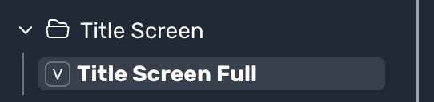

# Title Screen

The title screen is the first thing players see after your game is loaded. 
You can customize the title by using the **title screen full view**.

The following variables are available for use:

Variable | Type | Description
--- | --- | ---
isUserLoggedIn | Boolean | Returns True if the user is logged in and false if they are not.
isUserVerified | Boolean | Used to check if the user has verified their email.
gameId | String | Returns the unique ID of the current game.
isOpenedFromIFrame | Boolean | Returns True if the game is opened from an Iframe, False if not.
gameSlug | String | Returns the slug of the game ('/game/gameSlug').
gameDetails.name | String | Returns the Name / Title of the game.
gameDetails.tier | Number | Returns the game tier, e.g., 2 for tier 2.
gameDetails.creator.name | String | Returns the username of the game creator.
gameDetails.cover | String | Returns the game Cover URL, e.g., https://../game.png.
gameDetails.enableVideoChat | Boolean | Returns True if video chat is enabled, False if not.
gameDetails.videoChatEnabled | Boolean | Returns True if the user has video chat enabled, False if not.
gameDetails.isGuestPlayerAllowed | Boolean | Returns True if guest users can play the game, False if not.
menudiv | String | Returns the description of the game.
discordLink | String | Discord URL.
facebookLink | String | Facebook URL.
twitterLink | String | Twitter URL.
youtubeLink | String | YouTube URL.
androidLink | String | Android URL.
iosLink | String | iOS URL.
isMobile | Boolean | Returns true when the device used is a mobile device.
gamePlayInstructions | String | Returns the game play instructions.

The following components are available for use:

Component | Description
--- | ---
serverList | Section to display server list dropdown.
loginForm | Section to display login form.
coinShop | Section to display coin shop and its items.
playForm | Section to show the play form (which includes the play button).
sideMenu | Section which contains links to various other sections.
skinShop | Section to view skin shop.
chat | Section to render chat in the landing page.

