# The Environment Section

  

- **[Global Variables](#what-are-global-variables-and-why-use-them)** — accessible anywhere in your game, for storing shared data such as scores, timers, or game states.
- **[Regions](#regions)** — defined areas on your map (rectangles or polygons) used for triggers (e.g., `entityEntersRegion`) or special zones (safe zones, spawn zones, quest areas).
- **[Attributes](#attributes)** — customizable named data types (e.g., “Health,” “Mana,” “Strength”) that you can apply to Entities.
- **[Entity Variables](#entity-variables)** — default or custom variables on individual Units, Items, or Projectiles.
- **[Sounds](#sounds)** / **[Music](#music)** — Short audio clips or full-length background tracks, definable in the Environment for easy playback (e.g., sound effects, ambient music).
- **[Particle Emitter](#particle-emitter)** — Configurations for visual effects (like sparks, smoke, fire) using a particle system. Great for adding atmosphere or flair to your game.
- **[Bodies](#bodies)** — define collision shapes or physics bodies (e.g., circular or rectangular).
- **[States](#states)** — reusable conditions like “Dropped,” “Selected,” or “unselected.”
- **[Animations](#animations)** — collections of frames (e.g., “Idle,” “Run,” “Attack”) attachable to Entities.
- **[Abilities](#abilities)** — collections of frames (e.g., “Idle,” “Run,” “Attack”) attachable to Entities.
- **[Unit Type Groups](#unit-type-groups-item-type-groups)** / **[Item Type Groups](#unit-type-groups-item-type-groups)** — grouping multiple Units or Items for shared logic.
- **[Secret Variables](#secret-variables)** — hidden or special-purpose variables (like puzzle solutions).

**Relationship to Other Folders**  
The **Environment** is the root for global data. Anything defined here (like an Attribute or Region) can be referenced throughout the game—whether by Items, Projectiles, or Units.

### Video Overview of Environment

For a deeper explanation, check out this short video:  
[**Watch “What Is the Environment?”**](https://youtu.be/yXaTbrJW1ug)

---

### What Are Global Variables (and Why Use Them)? 
### Video Overview of Environment

For a deeper explanation, check out this short video:  
[**Watch “What are Global Variables and How To Use Them?”**](https://youtu.be/0YF0lwEcbT0)

In Modd.io, **Global Variables** are project‐wide data or references accessible from any script or event in your game. They’re especially useful for:

- Storing universal states or settings (e.g., game difficulty, total kills, a `questActive` flag).
- Holding references to a specific entity (like a key Unit or Item) that multiple scripts need to check or modify.
- Tracking progress across multiple events (e.g., puzzle solutions, a scoreboard).

Because they’re global, you don’t have to pass them around as parameters—any script can read or modify them if necessary.

#### Global Variables Panel Example

Here’s how it looks in the editor:

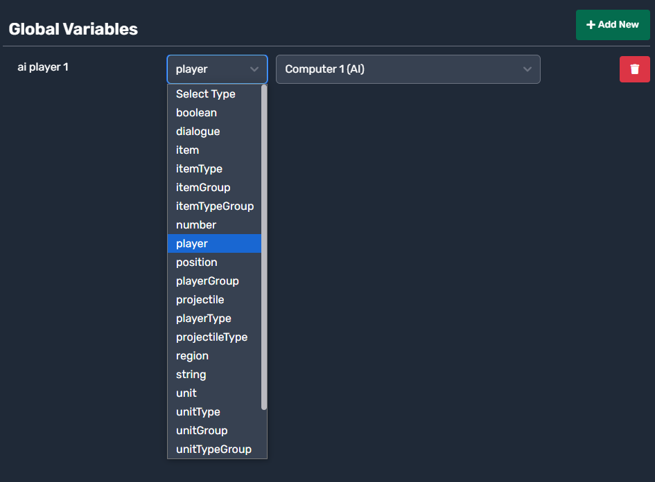

---

### Variable Types & Common Use‐Cases

Below is a list of types you can pick for a Global Variable in Modd.io, along with typical scenarios where each might be useful.

#### **boolean**
- **What it is:** A true/false value  
- **Example Use:**
  - Tracking if a quest is completed or not (`questComplete = true`)
  - Indicating whether a boss event is active (`bossSpawned = false` initially, then `true` later)

#### **dialogue**
- **What it is:** A reference to a Dialogue entry (from your “Dialogues” system folder)  
- **Example Use:**
  - Storing which NPC conversation should trigger next
  - Switching an NPC’s dialogue if a global condition changes

#### **item**
- **What it is:** A reference to one specific Item entity in the world  
- **Example Use:**
  - Tracking a unique “Sacred Sword” item placed on the map
  - Checking if that particular item still exists or if a player is holding it

#### **itemType**
- **What it is:** A reference to the blueprint (Type) of an Item, rather than an individual spawned item  
- **Example Use:**
  - Spawning new copies of the same item (e.g., `"HealthPotionType"`) at different places
  - Creating a shop that sells `"SwordType"`

#### **itemGroup**
- **What it is:** A collection of specific item entities  
- **Example Use:**
  - Keeping track of all currently spawned potions on the map
  - Removing items in `dropItemsGroup` when a wave ends

#### **itemTypeGroup**
- **What it is:** A group of item types (blueprints), not the actual spawned items  
- **Example Use:**
  - “All Weapons” group (`SwordType`, `BowType`, `AxeType`) to easily apply shared logic (e.g., increase damage)

#### **number**
- **What it is:** Any integer or decimal value  
- **Example Use:**
  - Score counters (`globalScore = 100`)
  - Timers, currency amounts, or wave counters (`waveNumber = 3`)

#### **player**
- **What it is:** A reference to a single Player entity (human or AI)  
- **Example Use:**
  - Storing a special AI player (`bossAIPlayer`)
  - Keeping track of the “lastAttackingPlayer” for kill credit

#### **position**
- **What it is:** An (x,y) coordinate in the game world  
- **Example Use:**
  - `spawnPoint = {x:100, y:200}` to quickly spawn or teleport units
  - Marking a `safeZoneCenter` for pathfinding or camera usage

#### **playerGroup**
- **What it is:** A collection of Player entities  
- **Example Use:**
  - Team-based logic: `redTeamGroup` includes all Red Team players
  - Broadcasting messages or applying effects to all in `adminPlayersGroup`

#### **projectile**
- **What it is:** A reference to a single Projectile entity currently in the world  
- **Example Use:**
  - Tracking a special “MagicArrow” needed to trigger a quest step
  - Checking if a “Bomb” projectile is still active

#### **playerType**
- **What it is:** A reference to a blueprint of a Player Type (e.g., “Warrior,” “Mage,” “AI Player”)  
- **Example Use:**
  - Spawning AI players with a particular Player Type
  - Dynamically switching a human player’s Player Type if conditions are met

#### **projectileType**
- **What it is:** A reference to a blueprint for a Projectile (e.g., “Fireball” or “Arrow”)  
- **Example Use:**
  - Summoning or firing that projectile in an event
  - Changing stats for a projectile type at runtime

#### **region**
- **What it is:** A reference to a Region you’ve defined on the map  
- **Example Use:**
  - `safeZoneRegion` to check if a player is inside or to spawn units within
  - `questAreaRegion` to see if the quest triggers when the player enters

#### **string**
- **What it is:** A text value (any sequence of characters)  
- **Example Use:**
  - Storing puzzle solutions (`secretCode = "DRAGON"`)
  - Dynamic messages or quest titles

#### **unit**
- **What it is:** A reference to a single Unit entity (e.g., a specific NPC or monster)  
- **Example Use:**
  - `bossUnit` to track a single boss monster’s HP or position
  - `npcWizardUnit` if you need to change its dialogue or states mid‐game

#### **unitType**
- **What it is:** A reference to a blueprint for a Unit (e.g., “Slime,” “Zombie,” “Guard”)  
- **Example Use:**
  - Spawning waves of the same Unit Type in a tower‐defense scenario
  - Creating “npcGuardType” for guards at certain gates

#### **unitGroup**
- **What it is:** A collection of Unit entities  
- **Example Use:**
  - `activeZombiesGroup` for all spawned zombies
  - `friendlyNPCsGroup` for an AoE healing effect

#### **unitTypeGroup**
- **What it is:** A group of unit types (blueprints)  
- **Example Use:**
  - `AllUndeadTypes` (SkeletonType, ZombieType) for common logic (e.g., extra fire damage)
  - `AllFriendlyTypes` (VillagerType, MerchantType, GuardType) for universal behaviors

#### **object / prop / propType**
- **What it is:** Occasionally used references for decorative/interactive props (barrels, trees, etc.) or generic data  
- **Example Use:**
  - `propType = "BarrelType"` to spawn breakable barrels
  - `prop` = a specific spawned barrel you might remove or track

---

#### Putting It All Together: Practical Examples

Here are a few scenarios to illustrate how Global Variables can tie your game together:

### Step 1: Scoreboard & Team Logic
- Use two `number` variables: `redTeamScore` and `blueTeamScore`.
- Use `playerGroup` for “redTeamPlayers” and “blueTeamPlayers.”

### Step 2: Quest / Dialogue Flow
- Use a `boolean` (`questStarted = true`) when the player accepts a quest.
- Store a `dialogue` reference (`questDialogue`) to switch NPC conversation if `questStarted` is true.

### Step 3: Spawning & Tracking a Special Boss
- Use a `unitType` (`bossType = "DragonUnitType"`).
- On an event trigger, spawn that unit and store it in a `unit` variable (`bossUnit`).

### Step 4: Large Item/Enemy Clear
- Keep a `unitGroup` (`zombieWaveGroup`) for all newly spawned zombies.
- When the wave ends, remove all members of `zombieWaveGroup`.

### Step 5: Teleporting
- Store a `position` (`teleportLocation`) for quick warping.
- If `bossDefeated = true`, send players to `teleportLocation`.

---

### Key Takeaways

- **Global Variables** let you maintain states, references, and counters accessible from any script in your Modd.io game.  
- **Choosing the right type** (e.g., `unit` vs. `unitType`) helps Modd.io’s event system handle them correctly.  
- Global Variables reduce the need for passing parameters around, simplifying broad game-wide mechanics.

---

### Final Note on Variable Types

Each type ensures the data is stored and handled correctly (e.g., storing a “unit” variable actually references a spawned unit in the game world, whereas “unitType” references the definition/blueprint you can spawn). Picking the right type helps keep your code clean and allows Modd.io’s event system to understand exactly what you’re referencing (making collisions, spawning, or group logic easier).

---

### Regions 
### Video Overview of Environment

For a deeper explanation, check out this short video:  
[**Watch "How To Add & Use a Map Region"**](https://youtu.be/lbJZBXsA6zw)

In Modd.io, **Regions** are defined areas on your map—rectangles or polygons—that you can use for triggers (e.g., `entityEntersRegion`), safe zones, spawn zones, quest areas, and more. Any region you draw in the Map Editor will appear in the **Environment → Regions** panel, where you can manage their names, sizes, and other properties.

#### Drawing a Region in the Map Editor

The easiest way to create or edit a region is inside the **Map Editor**. You select the “Regions” tool (or similar), then draw or drag the region directly onto the map.

  

> *Example:* Above is a simple example of a region being drawn on the map.

#### Editing Region Properties

After drawing or selecting a region, you can **edit** its properties—like name, X/Y position, width, height, and inside color.

  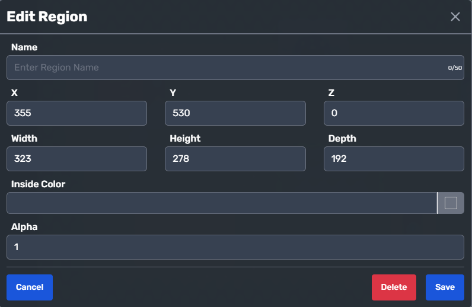

- **Name**: An optional identifier (e.g., “spawnArea” or “castleEntrance”).  
- **X, Y, Z**: The coordinates (and depth) of your region in the game world.  
- **Width/Height**: Size of the region’s bounding box.  
- **Inside Color / Alpha**: How it appears in the editor (not visible to players unless you design it that way).

#### Regions in the Environment Panel

Once created, your Regions will show up in **Environment → Regions**:

  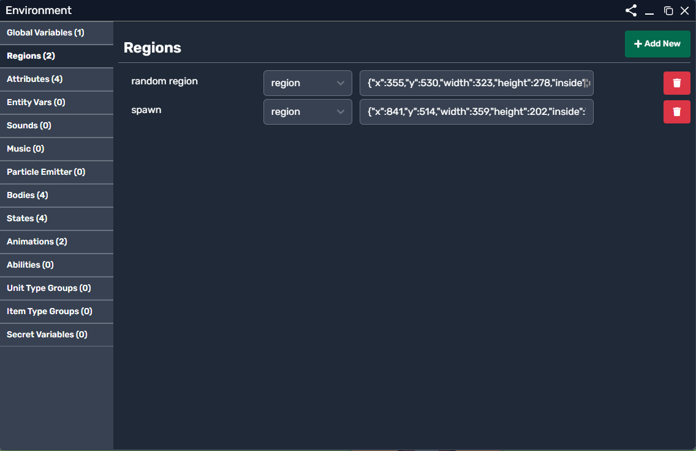 Regions panel in Modd.io"
    title="Regions in Environment Panel"
    style="width: 600px; height: auto;" />

Here, you can see each Region’s name, type (“region”), and underlying data (like `x`, `y`, `width`, `height`, etc.). You can also rename, delete, or add new Regions from this panel.

---

### Using Regions in Scripts

Modd.io provides two key triggers to leverage regions in your **World Scripts**:

>**when [entity] enters a region**

>**when [entity] leaves a region**

This allows you to run specific code whenever a player, unit, or item crosses the boundary of a named region.

Here's an example of our player(Adventurer) being spawned in the **spawn** region:

  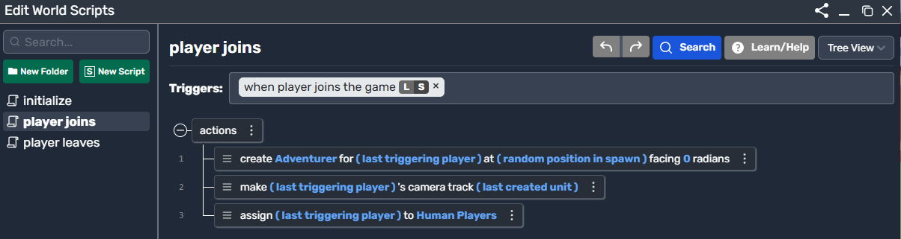 Regions panel in Modd.io"
    title="Regions in Environment Panel"
    style="width: 1000px; height: auto;" />

---

### Key Takeaways for Regions

- **Map Editor First**: You typically define Regions by drawing them on your map. This is the fastest, most visual approach.  
- **Environment → Regions**: Once created, each Region appears in the Regions panel, where you can rename or delete it.  
- **Scripting Triggers**: Use `entityEntersRegion("regionName", whoEnters)` or similar events to detect when players, monsters, or items cross that boundary.  
- **Rectangles/Polygons**: Depending on your version of Modd.io, you can create either rectangular or polygonal regions for more complex boundaries.  
- **Integration**: Perfect for marking safe zones, quest triggers, spawn areas, or any zone-based logic in your game.

### Attributes 

### Video Overview of Environment

For a deeper explanation, check out this short video:  
[**Watch "What Are Attributes & How to Apply Them"**](https://youtu.be/d_Uw8y-_Usw)

In Modd.io, **Attributes** are **customizable named data types** that you can apply to various Entities—most commonly Units, Items, or Projectiles. For instance, you might create attributes called “Health,” “Mana,” or “Speed.” By defining Attributes in the **Environment → Attributes** panel, you can then **assign** them to your Units or Items and control their initial values, max ranges, regeneration rates, and more.

---

### How Attributes Appear in the Editor

In the **Environment** panel, you’ll see an **Attributes** list showing each defined attribute’s **Name**, **Default/Range**, **Color**, etc.:

  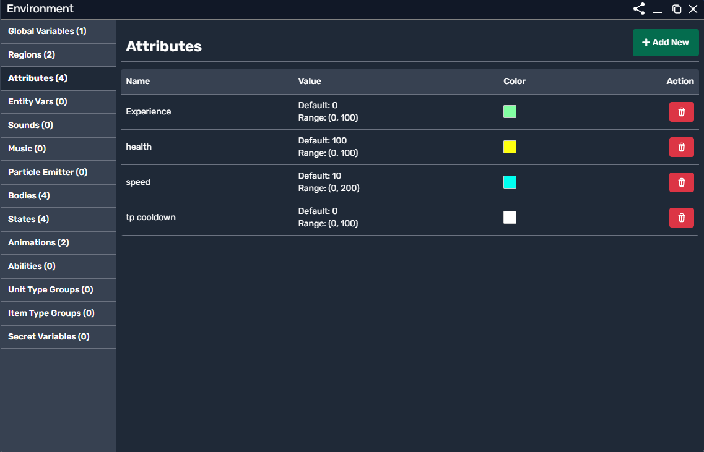

> *Example:* “Experience,” “health,” “speed,” and “tp cooldown” attributes are shown with their default values and ranges.

---

### Editing an Attribute

When you add or click an attribute, you’ll see a **General** settings tab (and sometimes additional display/config tabs). For example:

  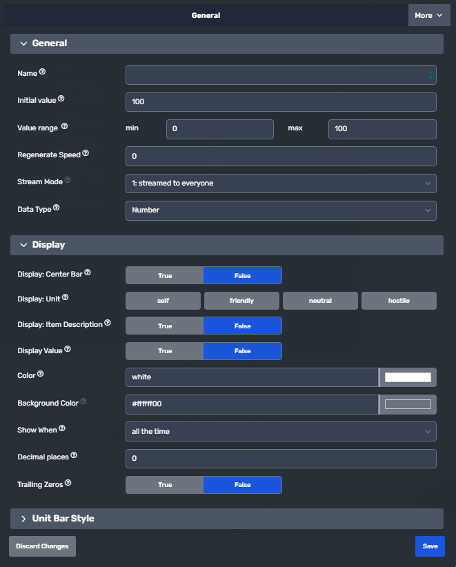

#### General Settings

1. **Name** – The identifier for this attribute (e.g., “health,” “mana,” “xp”).  
2. **Initial Value** – The value each entity starts with. For “health,” it might be 100.  
3. **Value Range** – The minimum and maximum possible values (e.g., `0` to `100` for health).  
4. **Regenerate Speed** – How quickly the value regenerates automatically (e.g., “5” might mean you gain 5 per second). Set to “0” if there’s no auto-regen.  
5. **Stream Mode** – Determines how the attribute is synced across the network. (e.g., `1: streamed to everyone` means all players see the attribute changes in real-time, useful for health bars.)  
6. **Data Type** – Usually “Number,” but you can also define other data types if your game logic requires them.

#### Display Settings

1. **Display: Center Bar** – Toggle whether you want a centered bar (often used for health in the UI).  
2. **Display: Unit** – Decide if the attribute is visible for “self,” “friendly,” “neutral,” or “hostile” units.  
3. **Display: Item Description** – Show or hide this attribute in an item’s description tooltip.  
4. **Display Value** – Whether the raw numeric value (e.g., “Health: 73”) is shown or hidden.  
5. **Color / Background Color** – Customize the bar or text color. For health, you might pick red or green.  
6. **Show When** – Conditions for when the bar or value is displayed (e.g., “all the time,” “only if changed,” etc.).  
7. **Decimal Places** and **Trailing Zeros** – Controls how many decimal places to show (if any).

#### Unit Bar Style
In some versions, you may see an additional **“Unit Bar Style”** section letting you specify how the bar appears above a Unit’s head in-game—size, offset, or icons. This can vary depending on your Modd.io setup.

---

### Why Use Attributes?

- **Core Stats**: They’re perfect for tracking any stat that can go up or down—HP, MP, stamina, or even kill counts.  
- **Dynamic Gameplay**: You can script changes to attributes (e.g., “take 10 damage,” “regenerate 5 health/sec”), so they become a foundation for your game’s mechanics.  
- **Display to Players**: Built-in support for bars or numeric displays (like a health bar) so players can see vital information at a glance.  
- **Network Syncing**: If Stream Mode is enabled, attribute changes are reflected in real-time for all players—ideal for multiplayer.  
- **Integration**: Items can modify an attribute (like a sword that raises “damage”), or Player Types can reference these attributes to set base stats.

---

### Quick Checklist: When to Use an Attribute Over an Entity Variable

Ask yourself:

- **Do you need to display the value on the Unit (e.g., a health or mana bar)?**  
- **Do you want the value to automatically increase or decrease over time (regen)?**  
- **Should the value be clamped to a minimum and maximum (e.g., 0–100)?**  
- **Do you want a script trigger/event when the attribute becomes full or empty?**  

If you answered **“yes”** to any of these, an **Attribute** is likely the better choice. Attributes make these features easy to configure without writing a lot of extra code.

---

### Tips & Best Practices

1. **Name Attributes Clearly**  
   - e.g., “health,” “mana,” “energy,” “armor,” so you know exactly what they track.  
2. **Set Logical Ranges**  
   - If your health never exceeds 100, use a `0–100` range. For XP, you might consider `0–999999` if players level up frequently.  
3. **Regeneration & Scripts**  
   - Combine a small “Regenerate Speed” with scripts for more complex systems (e.g., poison drains health, resting accelerates regeneration).  
4. **Use Colors**  
   - Distinct colors help you visually separate multiple attribute bars (e.g., red for HP, blue for MP).  
5. **Check Performance**  
   - Streaming many attributes in real-time can slow large-scale multiplayer. Only stream what’s truly necessary (like health or ammo).

---

## Entity Variables 

### Video Overview of Entity Variables

For a deeper explanation, check out this short video:  
[**Watch "When & How to Use Entity Variables"**](https://youtu.be/QwyeMbOne3M)

In Modd.io, **Entity Vars** are per-entity data fields automatically attached to every **Unit**, **Item**, or **Projectile**. They’re similar to **Attributes**—but without the built-in ranges, UI display, or regeneration logic—and are entirely separate from **Global Variables**, which apply to the entire game or session rather than individual entities.

### Understanding the Differences

- **Global Variables**  
  - Exist at the **game level** (not tied to any single Unit/Item/Projectile).  
  - **Shared among all players**; changing a global variable affects everyone.  
  - Remain in place even if no players are present.

- **Entity Variables**  
  - Stored **inside** each Unit, Item, or Projectile.  
  - Each entity has its **own** instance, so values can differ per entity.  
  - Great for storing per-entity data like a faction name, an “ownerID,” or a boss flag.

- **Attributes**  
  - Built-in stats like Health or custom Attributes you define with UI options (range bars, display text, regeneration, etc.).  
  - Ideal when you need **visual indicators** or advanced settings for your data (e.g., an HP bar).  
  - More overhead than a raw Entity Variable, so only use them when you need those extra features.

### Why Use Entity Vars?

1. **Custom Data**: If your Units need a “faction” or an “isBoss” boolean, you can define those once in **Environment → Entity Vars**. Each spawned entity will then carry and store its own value.
2. **Lightweight**: Unlike Attributes, Entity Vars don’t come with built-in UI or range settings—perfect for purely internal or script-based logic.
3. **Universal**: Because they apply to all **Units**, **Items**, and **Projectiles**, you can handle logic consistently across many entity types. 

### How Entity Vars Appear in the Editor

Under **Environment → Entity Vars**, you’ll see a list of custom fields you’ve defined. For example:

  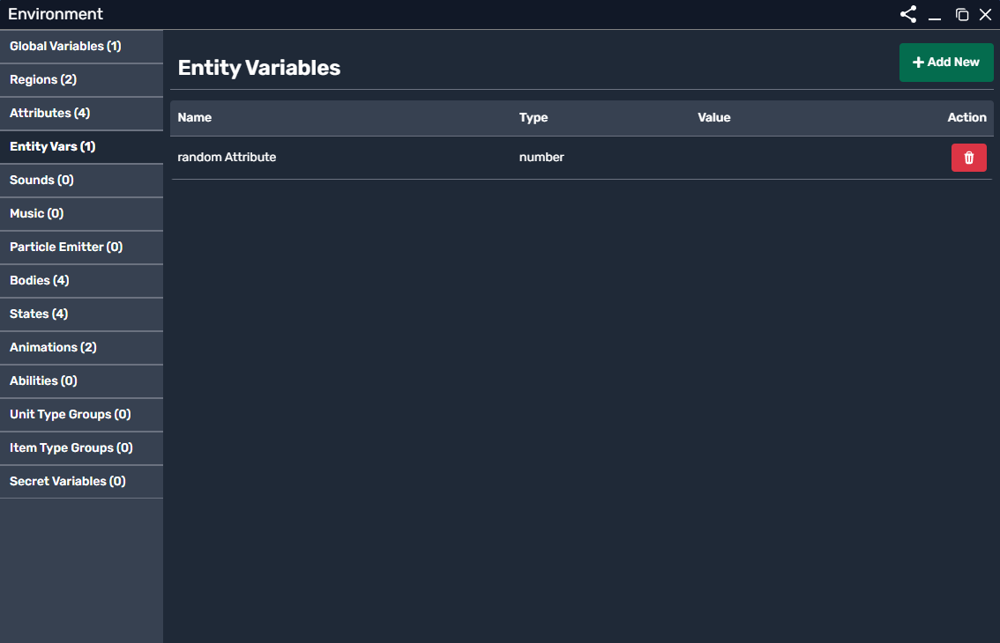

> **Example:** A “random Attribute” variable of type `number`. Every Unit/Item/Projectile in your game will have this variable available, though the actual value may differ per entity.

---
## Music & Sounds

Modd.io provides two ways to manage **audio** within your game:  
- **Sounds**: Short audio clips (like sound effects for clicks, hits, or explosions).  
- **Music**: Typically longer audio tracks or background music loops.

By defining **Sounds** and **Music** in **Environment**, you can reference them easily in scripts, items, or states.

---

### Sounds 

Under **Environment → Sounds**, you’ll see each defined sound with:
- A **Name** (your reference label).
- A **Value** (the URL to the audio file).
- A **Play** button to quickly preview it.

  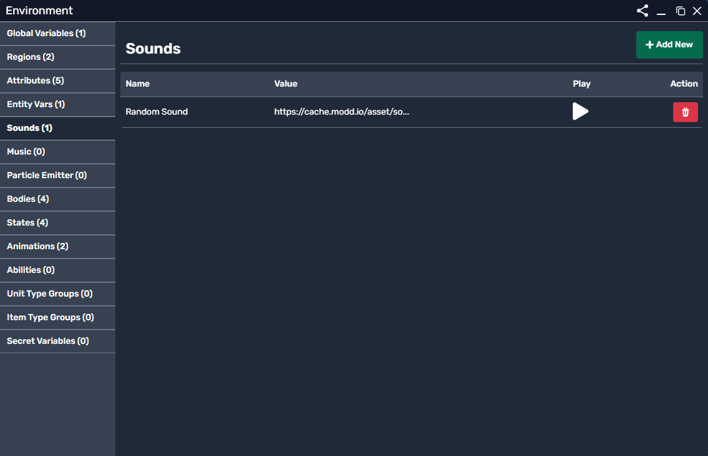

For example, “Random Sound” might point to `https://cache.modd.io/asset/sounds/explosion.mp3`. You can test it by clicking **Play**.

**Use Cases**  
- **Sound Effects** for collisions, attacks, UI clicks.  
- **Randomized Cues**: e.g., pick a random “zombieGroan” from multiple sound entries.  
- **State or Animation** Hooks: e.g., play a “fire” sound effect when a “Burning” state is applied.

---

### Music 

Under **Environment → Music**, you’ll see each defined track with:
- A **Name** (your reference label).
- A **Value** (the URL to the audio file).
- A **Play** button to quickly preview it.

  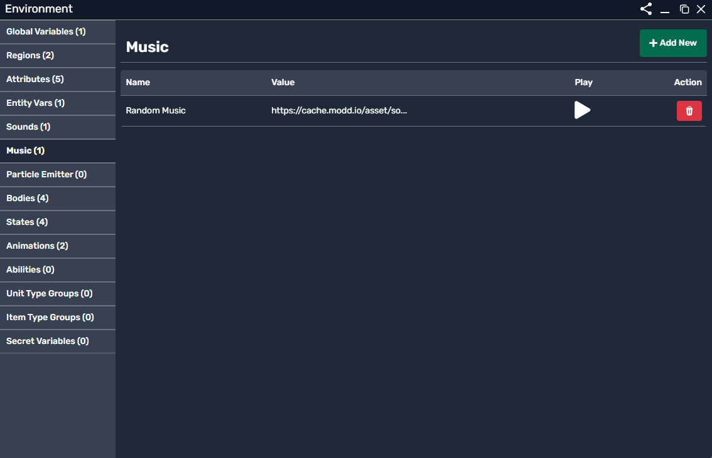

For example, “Background Music” might point to `https://cache.modd.io/asset/music/background.mp3`. You can test it by clicking **Play**.

**Use Cases**  
- **Background Music**: Loops continuously to create a background atmosphere.  
- **Cutscene or Event** Music: Plays a specific track when a cutscene starts or a unique event occurs.

---
## Particle Emitter

**Particle Emitters** let you create visual effects in your game—think sparks, smoke, fire, or floating magic particles. By defining these emitters in **Environment → Particle Emitter**, you can attach them to Units, Items, or States, or spawn them via scripts to enhance your game’s visuals.

### Particle Emitter Panel

Under **Environment → Particle Emitter**, you’ll find a list of particle definitions you’ve created:

  

> *Example:* Initially empty. After adding one, you’ll see its name and the image used for the particle.

### Particle Editor 

Click **Add New** or select an existing emitter to open the **Particle Editor**:

  

Here are the core fields and what they do:

1. **Name**  
   A label for your emitter (e.g., “FireSparks,” “HealingAura”).

2. **Image url**  
   The image or sprite each particle will use (e.g., a small flame or spark graphic). Must be <100 KB.

3. **Z-index**  
   - **Layer**: Which layer (e.g., “background,” “walls,” “debris”) the particles appear on.  
   - **Depth**: Numeric depth within the layer for rendering order.  
   - **Offset**: Additional offset on that axis.

4. **Direction (X / Y / Z)**  
   Specifies the *initial* direction the particles move in. You can fine-tune angles if you want them going up/down/sideways in a 3D or 2D environment.

5. **Lifetime**  
   - **Min/Max**: How long (in milliseconds) each particle lives before disappearing.  
   - e.g., `1000–2000` means each particle lasts between 1–2 seconds.

6. **Scale**  
   - Set an initial size for each particle (X, Y).  
   - **Increase per second**: If you want particles to grow or shrink over time.

7. **Emit zone (X / Y / Z)**  
   - Defines the region in which new particles can spawn (like a rectangle or box).  
   - e.g., if you set `X=50, Y=0, Z=50`, new particles appear randomly in that 50×50 area.

8. **Emit frequency**  
   - **1** to **5000**: How often new particles spawn. Lower = fewer particles, higher = a more dense emission.

9. **Duration**  
   - How long the emitter spawns new particles (in ms). After this time, no more particles are created (but existing ones may still exist until their lifetime ends).

10. **Gravity / Velocity (Advanced)**  
   - Some versions may let you specify gravity, velocity spread, or random angles for more complex effects.

---
## Bodies 

In Modd.io, **Bodies** define the **collision shapes** and **physics properties** that an Entity (Unit, Item, or Projectile) can use. They determine whether something is **static** (like a wall), **dynamic** (like a movable crate), or **kinematic** (like a moving platform). By creating multiple Body definitions in the **Environment → Bodies** panel, you can easily assign them to different Entities to control how they collide, move, or interact with the world.

### Bodies in the Environment Panel

When you open **Environment → Bodies**, you’ll see a list of the body definitions you’ve created:

  

> *Example:* Here, “default,” “dropped,” “selected,” and “unselected” are four body definitions. Each can have unique physics or collision rules.

### Editing a Body

Click **Add New** (or select an existing Body) to open the **Body Editor**. You’ll see a range of settings for shape, density, friction, offset, rotation locks, collision layers, and more:

  

Below are some key fields you might configure:
### General Info

- **Name**  
  A label for this body definition (e.g., “dynamicBox”, “flyingEnemyBody”). Helps you identify it later when assigning bodies to entities.

- **Type**  
  - **dynamic**: Fully simulated; can move and rotate under forces or collisions.  
  - **static**: Immovable body (like walls or floors).  
  - **kinematic**: Moves under script control, not by physics forces.

- **Width / Height / Depth**  
  Dimensions of the collision bounding box (X, Y, Z). For 2D-style games, you might only use Width/Height. Depth can matter in 3D or if you want a “thick” bounding box.

- **Z-index**  
  Controls rendering/layer ordering relative to other game objects. Often used with:
  - **Layer**: A named collision/render layer (e.g., “debris,” “background”).
  - **Depth**: Additional numeric layering within that layer.
  - **Offset**: Shifts the drawing or collision box along the Z-axis (in some setups, it may control stacking order).

### Transform & Movement

- **Fixed rotation**  
  - **True**: The body will not rotate at all, even if forces or collisions would normally spin it.
  - **False**: Allows rotation according to physics or script.

- **Lock Rotation (x, y, z)**  
  Select which axes the body is prevented from rotating around. In a 2D game, you might lock rotation on the x and z axes, allowing only y-axis rotation.

- **Bullet**  
  - **True**: Enables continuous collision detection (CCD), important for fast-moving bodies (e.g., bullets or arrows) so they don’t “tunnel” through walls.
  - **False**: Standard discrete collision.

- **Affected by Gravity**  
  - **True**: Subject to global gravity.  
  - **False**: It will float or remain where placed, ignoring gravity forces.

- **Allow Sleep**  
  - **True**: The physics engine may let the body “sleep” to save CPU if it’s idle.  
  - **False**: Body never sleeps; always actively simulated.

### Collision & Physics

- **Collides With**  
  A set of checkboxes (Units, Items, Projectiles, Walls, Props, Sensors). Determines which categories of entities will physically collide with this body.

- **Angular Damping**  
  How quickly rotational velocity is reduced over time (like friction for rotation). Higher values = body slows its spin faster.

- **Linear Damping**  
  How quickly linear (movement) velocity is reduced over time, effectively simulating air resistance or friction. Higher values = it slows more quickly.

- **Rotation Speed**  
  If the body has a built-in rotational movement (not purely physics-based), this might define how fast it spins each frame or per second.

- **Sprite Scale**  
  Scales the visual sprite associated with this body. Does not necessarily alter collision shape if you’re using a separate fixture size.

- **Rotate (3D)** (X, Y, Z)  
  Allows you to rotate the body or its sprite in 3D space. For a 2D game, often left at 0, 0, 0.

### Fixtures

Fixtures define the actual **collision shape** and physical properties (mass, bounce, friction):

- **Sensor**  
  - **True**: The body detects overlaps but does not physically collide or push things (great for trigger zones).  
  - **False**: Standard physical collision.

- **shape**  
  - Typically “rectangle,” “circle,” or “polygon.”  
  - A rectangle might be used for boxes or floors; circles for rolling objects; polygons for more advanced shapes.

- **Density**  
  Affects the **mass** of the body—higher density = heavier object, meaning it’s harder to push around.

- **Friction**  
  How “slippery” surfaces are when colliding or sliding. 0.01 is quite slippery; larger values produce more friction.

- **Restitution**  
  “Bounciness.” A value of `0` means no bounce; `1` means it retains all velocity upon collision (perfectly elastic).

- **Size (Width / Height)**  
  The collision shape’s local size. This can differ from the overall body’s top-level Width/Height if you want more precise control.

- **Offset (X, Y)**  
  Moves the collision shape relative to the entity’s center or sprite. Positive X or Y shifts it right/up, etc.

### Joint Type
- **weld**: This body is locked (welded) to its parent or anchor. Typically used if you want two bodies permanently stuck together.  
- **none**: No special joint. The body is free.

### Anchors

- **Unit Anchor** (X, Y, Rotation)  
  Offsets how the body attaches to a **Unit** sprite. For instance, `Y=33` might place the collision box lower on a tall character sprite.

- **Item Anchor** (X, Y)  
  Similar concept for Items—where the body is anchored to the item graphic.

### Additional Settings

- **Billboard Effect**  
  - **Enabled**: Body (or sprite) always faces the camera (common in 3D or pseudo-3D views).  
  - **Disabled**: Normal rendering, which can rotate or face any direction.

- **Global Space**  
  - **True**: The body might ignore local transformations, referencing world coordinates.  
  - **False**: Follows local or parent transformations.

---

### Assigning Bodies to Entities

Once you’ve defined a Body in **Environment → Bodies**, you can assign it to a **Unit**, **Item**, or **Projectile** through the Entities panel (or script) by selecting that Body name. This way, you don’t have to reconfigure collision parameters each time—you just pick the Body definition you want.

### Why Use Bodies?

- **Consistent Physics**: Reuse the same Body definition (“default,” “heavy,” “light,” “sensor,” etc.) across multiple Entities for standardized physics.  
- **Complex Collision Layers**: Determine exactly which Entities should collide (e.g., projectiles only hitting walls and hostile units, not friendlies).  
- **Efficient Workflow**: Setting up all your collision shapes in one place means you can tweak them centrally if you decide you want more friction or a different shape.  
- **Diverse Gameplay**: Make some bodies dynamic and affected by gravity, while others are static barriers or “sensor” triggers that detect players crossing a zone.

---

By defining **Bodies** in the Environment, you give your Entities the collision and physics logic they need to interact with the game world. Combined with **Attributes**, **Entity Vars**, and other Environment features, Bodies bring your map’s physical interactions to life—whether it’s a bouncing fireball or a player-blocking wall.

---

## States 

In Modd.io, **States** are reusable conditions you can apply or remove from an entity (Unit, Item, or Projectile). Think of them as **labels** like “Stunned,” “Poisoned,” “On Fire,” or “Invisible.” Each state can alter an entity’s appearance (animations, particles) or behavior (collision body, sounds) while it’s active. When you remove the state, the entity reverts to normal.

### States in the Environment Panel

Under **Environment → States**, you’ll see a list of defined states:

  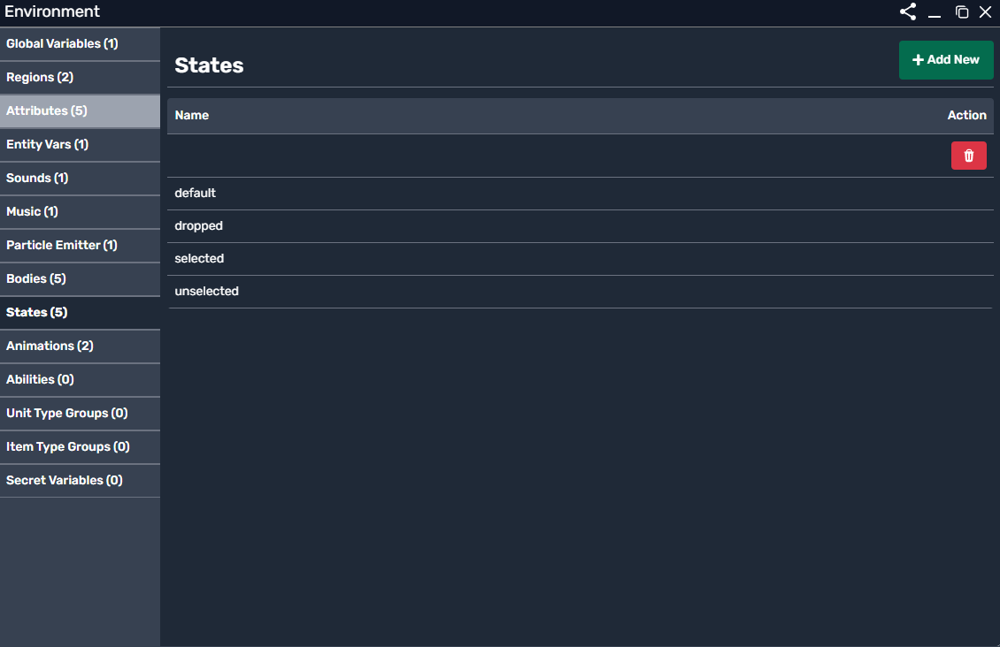

> *Example:* “default,” “dropped,” “selected,” and “unselected” are four states defined in the panel.

### Editing a State

When you create or select a state, you’ll see several fields in the **General** tab:

  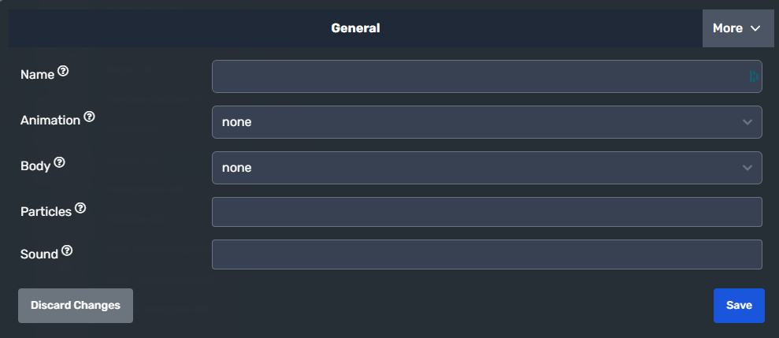

1. **Name**  
   - A label for your state (e.g., “poisoned,” “stunned,” “dropped”).

2. **Animation**  
   - Choose an animation to play if the entity has this state.  
   - e.g., If you have an “On Fire” state, you might link an “On Fire” animation or a burning sprite.

3. **Body**  
   - Select a body definition to use during this state.  
   - e.g., “noCollision” body if you want the entity to pass through walls while in a “Ghost” state.

4. **Particles**  
   - Attach a particle emitter that activates while the state is active.  
   - e.g., a smoke or flame particle effect for a “Burning” state.

5. **Sound**  
   - Reference a sound file to play in a loop (or triggered) while this state is active.  
   - e.g., a buzzing sound for “Electrified.”

---

## Animations 

In Modd.io, **Animations** let you define sets of images (frames) for an entity to cycle through—creating visual sequences like an “idle,” “run,” or “attack” animation. By defining them in **Environment → Animations**, you can later attach them to Units, Items, or States to bring your game’s visuals to life.

### Animations in the Environment Panel

Under **Environment → Animations**, you’ll see a list of all named animations:

  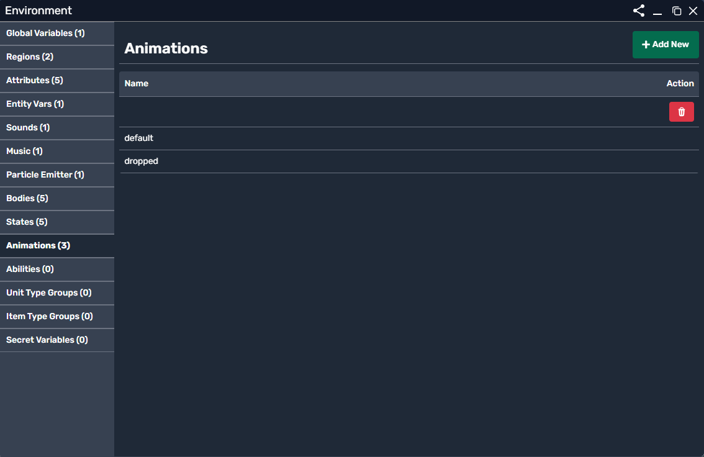

> *Example:* The list shows “default” and “dropped” animations. Each corresponds to a set of frames, speed, and loop behavior.

### Editing an Animation

When you create or select an animation entry, you’ll see a **General** tab with these fields:

  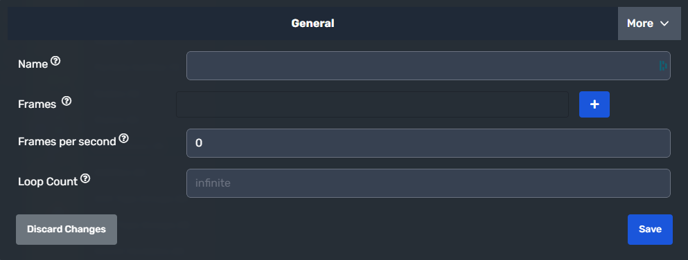

1. **Name**  
   - A reference label for your animation (e.g., “Idle,” “Run,” “Attacking”).

2. **Frames**  
   - A list or sequence of image URLs/sprites.  
   - Click the **+** button to add more frames, or paste the path to your sprite images.

3. **Frames per second**  
   - Sets how quickly the animation cycles through its frames. A higher value means faster animation.  
   - For example, 10 frames/sec is a moderate speed, 1 frame/sec is very slow.

4. **Loop Count**  
   - **infinite** (default): The animation repeats endlessly.  
   - **1** or any integer: The animation plays that many times, then stops on the last frame.

### Applying Animations

Once defined, animations can be referenced in several places:

- **Units**  
  Attach an animation to a unit’s “idle,” “move,” or “attack” behavior.  
- **States**  
  Use the **Animation** field in a State to display a “burning” or “poisoned” animation while that state is active.  
- **Items / Projectiles**  
  Give a projectile a spinning animation, or show an “open chest” sequence when an item is used.

### Practical Tips

1. **Consistent Frame Size**  
   - Keep all frames the same size/resolution for a smooth sequence.  
2. **Organized Filenames**  
   - Label frames in order (e.g., “attack_1.png,” “attack_2.png,” “attack_3.png”) to simplify importing.  
3. **Frame Rates**  
   - Idle animations can be slower (2–4 FPS), while run or attack might be 8–12 FPS.  
4. **Loop vs. One‐Shot**  
   - Infinite loops for idle or movement; single loop for something like a “hit” or “explosion” effect.  
5. **Performance**  
   - Very large or high‐FPS animations can impact performance in multiplayer scenarios. Keep an eye on file sizes.

---
# Abilities

Abilities allow you to define custom actions for units, such as attacks, special moves, or buffs. They can be activated via scripts, buttons, or conditions within your game.

## Overview

Abilities are managed under the **Abilities** panel in the **Environment** section. Each ability has various configurable attributes, including event scripts, cooldowns, and costs.

  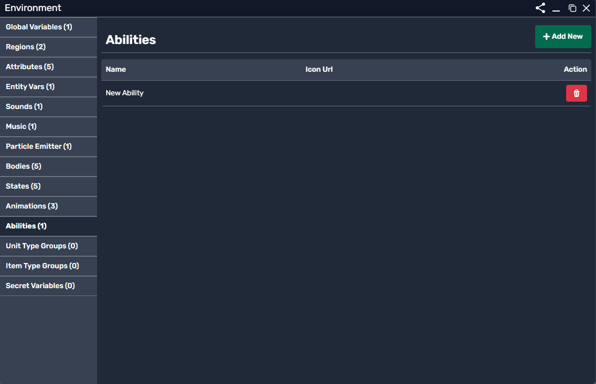

---

## Ability Properties

Each ability consists of multiple settings that define its behavior. Below is a breakdown of each property:

### General Properties

| Property           | Description |
|-------------------|-------------|
| **Name**          | The name of the ability, which helps identify it in scripts and UI. |
| **Event Scripts** | The scripts that will run when the ability starts and stops casting. |
| **Cast Duration** | The total time the ability takes to execute. Default is **infinite** unless specified. |
| **Cooldown**      | The delay before the ability can be used again after activation. |

---

### Cost Section

Abilities may have resource costs for activation. These costs can apply to units or players.

| Property                | Description |
|------------------------|-------------|
| **Unit Attributes**    | Defines the cost in unit attributes (e.g., Mana, Stamina). |
| **Player Attributes**  | Defines the cost in player-specific attributes (e.g., Gold, Energy). |

---

### Stream & UI Settings

| Property             | Description |
|---------------------|-------------|
| **Stream Mode**     | Determines whether the ability's execution is streamed to all players. |
| **Button Visibility** | Controls if the ability is displayed as a UI button. Options include **always show, show when usable, and never show**. |
| **Icon URL**        | Allows you to upload an image that represents the ability in the UI. |

  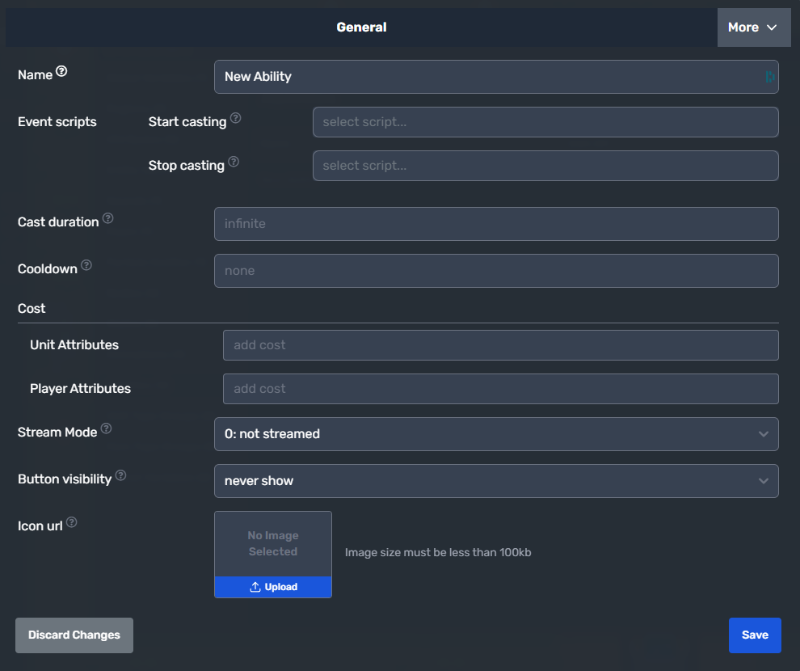

---

## How to Use Abilities

1. **Creating a New Ability**  
   - Navigate to **Environment → Abilities**.
   - Click **+ Add New** and configure the properties.
   - Assign scripts for **Start Casting** and **Stop Casting** to define what happens when the ability is used.

2. **Assigning Abilities to Units**  
   - Link an ability to a unit via scripts or predefined logic.
   - Ensure the ability's cost (if applicable) is manageable by the unit or player.

3. **Using Abilities in Scripts**  
   - Abilities can be triggered in-world scripts based on conditions.
   - Example: A script that checks a player’s mana before activating a fireball attack.

---

## Example Use Cases

- **Combat System:** Define attack abilities for different unit classes.
- **Buffs/Debuffs:** Apply temporary stat changes or effects on units.
- **Building Mechanics:** Allow players to construct objects using an ability.

---

## Key Takeaways

- Abilities are fully customizable and can execute scripts on activation.
- They may require costs, have cooldowns, and be toggled via UI buttons.
- Integrating abilities into gameplay can add dynamic mechanics such as combat skills or utility actions.

---
## Unit Type Groups / Item Type Groups 

Modd.io gives you two special groupings for Entities:

- **Unit Type Groups**: Collections of specific **Units** (player classes, NPC definitions, etc.).
- **Item Type Groups**: Collections of **Items** (weapon types, potions, etc.).

By creating these groups under **Environment → Unit Type Groups** or **Environment → Item Type Groups**, you can easily script behaviors or events that apply to multiple entity types at once.

---

### Unit Type Groups

**Unit Type Groups** let you classify different Unit definitions under a single label. For example, you could have a group called “AllUndead” that includes “Zombie,” “Skeleton,” and “Ghost.” Another group, “FriendlyNPCs,” might include “Villager” and “Guard.”

#### How They Appear

Under **Environment → Unit Type Groups**, you’ll see a list of groups you’ve created:

  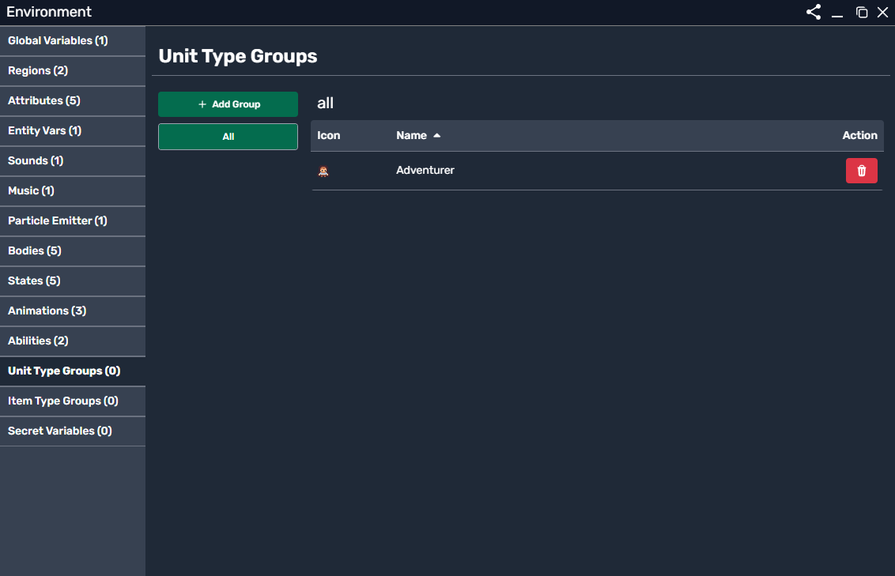

> *Example:* A group called “all” that contains a single “Adventurer” Unit. You can add multiple Unit Types to the same group.

**Why Use Them?**
1. **Batch Scripting**  
   - Instead of writing `onCollide(player, ZombieType)`, `onCollide(player, SkeletonType)`, etc., you can do `onCollide(player, AllUndead)` and handle them in one block.  
2. **Shared Logic**  
   - If you want the same events or states to apply to multiple Unit Types, group them and write a single script.  
3. **Easier Maintenance**  
   - As you add more Unit Types (e.g., new monsters), just drop them into an existing group rather than editing multiple scripts.

**Global Variables** can also reference a Unit Type Group by selecting `unitTypeGroup` as the data type, then picking the Unit Types you want. For instance, you might create a `randomKey` that references “Adventurer” plus a new “Ranger” in the same group, letting you spawn from that group or apply shared logic easily.

---

### Item Type Groups

**Item Type Groups** work the same way but for **Items**. Create a group—like “AllWeapons”—and add “Sword,” “Bow,” “Axe.” Another group might be “Potions” for “HealthPotion,” “ManaPotion,” etc.

#### How They Appear

Under **Environment → Item Type Groups**, you’ll see something like:

  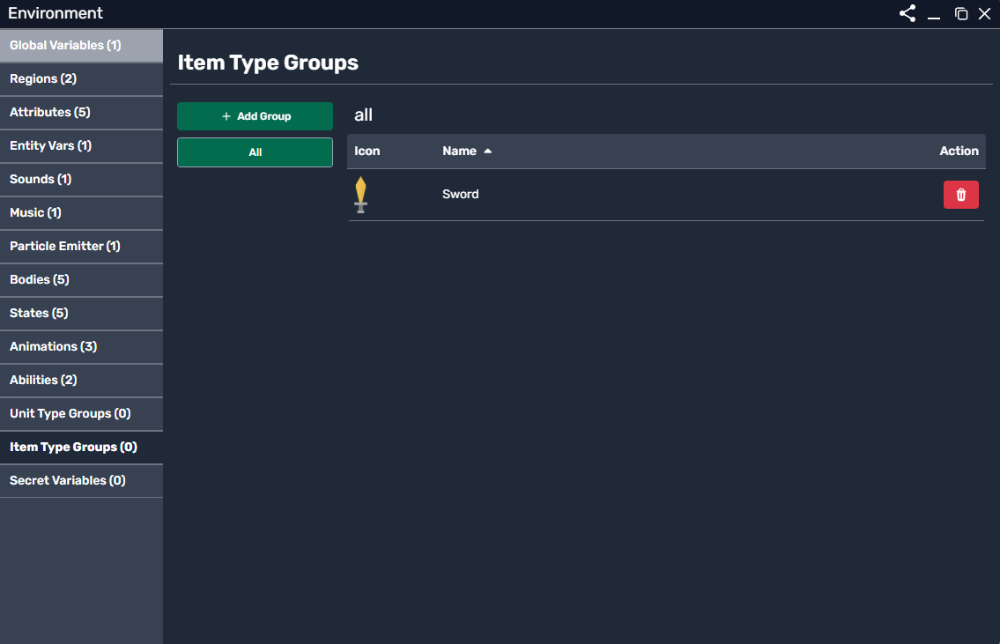

> *Example:* A group called “all” that currently has just “Sword.” You could add more items to group them together.

**Why Use Them?**
1. **Script Efficiency**  
   - Handle multiple item types in one event: `onUseItem(itemGroup AllWeapons, player)` for anything that’s considered a weapon.  
2. **Organized Logic**  
   - If you have 10 different potions, place them into “AllPotions.” Then, in your shop or script, reference “AllPotions” for a discount or spawn routine.  
3. **Easier Expansion**  
   - As you add new items (e.g., a new magical sword), simply drop it into the “AllWeapons” group and it inherits the same logic.

**Global Variables** can also store an Item Type Group by choosing `itemTypeGroup` and picking which Item Types to include.

---

### Common Use Cases

1. **Spawning**  
   - Randomly spawn a monster from `AllUndead`, or spawn a random item from `AllTreasure`.
2. **Combat or Collisions**  
   - `onCollide(player, AllBosses)`—one event handles all boss collisions.  
   - `onUseItem(AllPotions, player)`—run code if any potion is used.
3. **Shops**  
   - A “weapons shop” might include any item from `AllWeapons`—easier than referencing each weapon individually.
4. **Quest Requirements**  
   - “Collect any item from `AllGems` to complete the quest.” Use a single check rather than enumerating gem types.

---

### Tips & Best Practices

- **Clear Naming**: If you have a group named “AllBosses,” it should logically include all your boss-type Units (Dragon, Giant, etc.).  
- **Nested Logic**: You can have multiple groups that overlap (e.g., “AllMonsters” and “AllUndead”). Just be mindful of how you handle events if an entity is in multiple groups.  
- **Script Once, Apply to Many**: The biggest advantage is referencing the group in code. If you add a new monster or item later, toss it in the group instead of rewriting scripts.

---

By using **Unit Type Groups** and **Item Type Groups**, you greatly simplify your code—grouping multiple entity definitions under a single label for collisions, events, or spawning. It’s a powerful organizational tool for large or complex games. 

---

## Secret Variables 

Secret Variables are used to store sensitive data that should not be publicly accessible in your game. Unlike Global Variables, Secret Variables are hidden from normal scripts and can only be accessed through specific secure functions.

  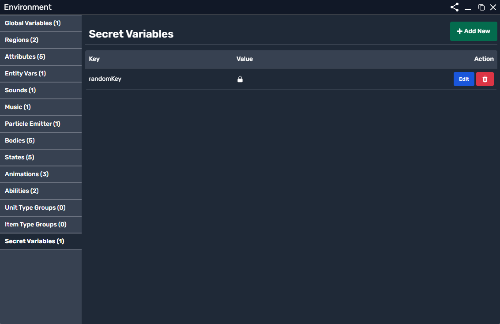

### What Are Secret Variables?
Secret Variables allow you to store confidential information, such as:
- API Keys for external services
- Secure player authentication tokens
- Private game settings that should not be visible to regular users

Since these values are encrypted, they **cannot** be directly read or modified by unauthorized scripts.

---

### Creating a Secret Variable
To add a Secret Variable, follow these steps:
1. Navigate to **Environment → Secret Variables**
2. Click on **+ Add New**
3. Enter a **Key** (this is the name you'll use to reference it)
4. Choose a **Data Type** (e.g., String, Object, Number)
5. Set the **Value** (such as an API URL or an object with headers)
6. Click **Save**

  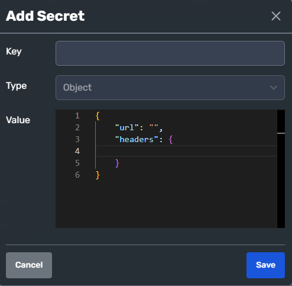

---

### Data Types for Secret Variables
When creating a Secret Variable, you can select different data types based on the kind of information you want to store:

- **Object** → Stores JSON-formatted data (e.g., API credentials)

---

