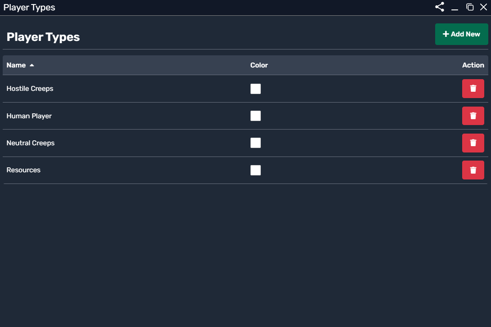
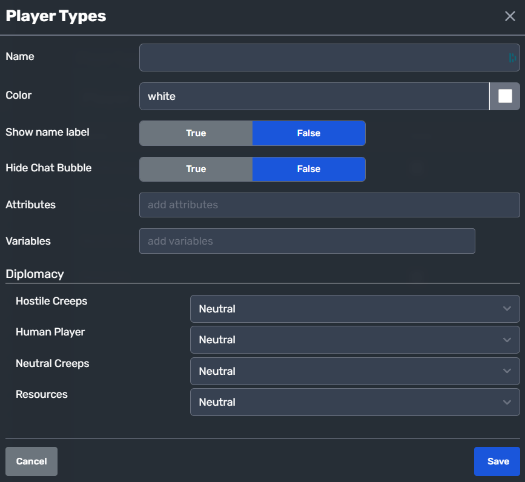

# Player Types

Player Types define different **factions, teams, or AI groups** in the game. Each entity in the game belongs to a Player Type, which determines its **diplomatic stance, behavior, and interactions** with other entities.

## Purpose of Player Types

Player Types allow you to group units, NPCs, and resources into different categories, making it easier to control their behavior, interactions, and combat mechanics. Some key uses include:

- **Faction-Based Gameplay**: Different AI or player-controlled teams.
- **Diplomacy**: Setting hostility, neutrality, or alliances between different Player Types.
- **Resource & AI Management**: Distinguishing between units, enemies, and non-playable entities.
- **Game Logic Control**: Dictating AI behaviors based on Player Type affiliations.

---

## Viewing & Managing Player Types

To manage **Player Types**, navigate to the **Player Types Panel**, where all defined Player Types are listed.

### Player Types Overview Panel
This panel provides an overview of some pre-existing Player Types in a game template.

  

- **Name**: Displays the Player Type's name.
- **Color**: Assigns a color for UI representation (used for team identification).
- **Action**: Allows **deleting** a Player Type.

To **add a new Player Type**, click the **"Add New"** button.

---

## Creating & Configuring a Player Type

When creating a new Player Type, you can configure multiple properties that define its behavior.

### Player Type Configuration Panel

  

#### General Properties:
| Property | Description |
|----------|-------------|
| **Name** | The name of the Player Type (e.g., "Human Player", "Hostile Creeps"). |
| **Color** | The assigned team color for identification. |
| **Show Name Label** | Toggles visibility of the player's name above their units. |
| **Hide Chat Bubble** | Hides chat bubbles from this Player Type. |
| **Attributes** | Allows defining attributes specific to this Player Type. |
| **Variables** | Enables storing custom data related to the Player Type. |

---

## Diplomacy & Relations
NOTE: You need other playerTypes for diplomacy to show up.

One of the key features of **Player Types** is diplomacy. You can set how a Player Type interacts with others.

| Player Type | Relation |
|------------|----------|
| **Hostile Creeps** | Neutral, Friendly, or Hostile towards other Player Types. |
| **Human Player** | Defines whether the player is hostile or neutral to other factions. |
| **Neutral Creeps** | Typically neutral unless provoked. |
| **Resources** | Defines whether resources can be collected or owned. |

Each Player Type can have different diplomatic stances towards others:
- **Neutral**: No interaction unless provoked.
- **Friendly**: Supports and helps units of the same faction.
- **Hostile**: Engages in combat automatically.

---

## Practical Uses of Player Types

### 1. **Factions & AI Groups**
Player Types allow defining different **teams** or **enemy factions** in your game. Example:
- **Human Player** (controlled by a user)
- **Enemy AI** (hostile NPCs)
- **Neutral Creatures** (wildlife, passive mobs)
- **Resources** (collectible objects like trees, minerals)

### 2. **Combat & Diplomacy**
- If the **Human Player** is **hostile** to **Enemy AI**, their units will attack each other automatically.
- If **Neutral Creatures** are set to **neutral**, they will only retaliate when attacked.
- Resources can be configured to be **collectible** by certain Player Types.

### 3. **Multiplayer Team Systems**
For multiplayer games, Player Types help define **teams**:
- **Red Team**
- **Blue Team**
- **Spectators**
- **NPC Factions**

---

## Summary

- **Player Types** categorize units, resources, and AI into different groups.
- They define **diplomacy**, **combat behavior**, and **interactions** between factions.
- Used for **AI control, multiplayer teams, and game logic**.
- Can be customized with **attributes, variables, and visual properties**.

By setting up **Player Types** properly, you can create **dynamic AI behaviors, team-based multiplayer modes, and faction-based strategies** in your game.

