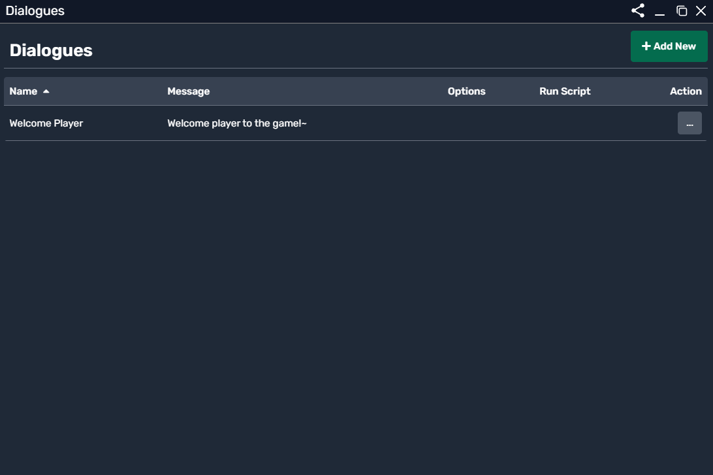
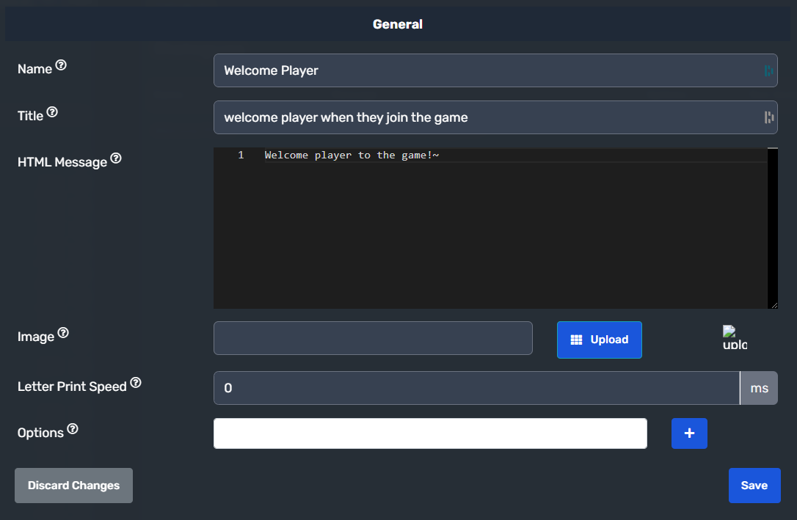
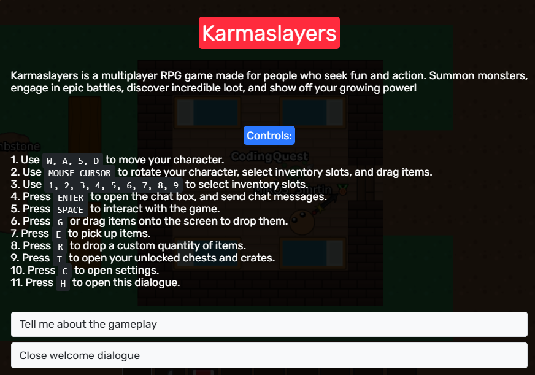

# Dialogue System

The **Dialogue System** allows the creation of scripted interactions within the game. These dialogues are used to display text-based messages when a player interacts with an NPC, object, or event.

## Overview of the Dialogue Panel

The **Dialogue Panel** lists all created dialogues, showing key information such as:

- **Name** – The reference name of the dialogue.
- **Message** – The text displayed to the player.
- **Options** – Any selectable choices the player can make.
- **Run Script** – Whether a script runs when the dialogue is triggered.
- **Action** – Options to edit or delete the dialogue.

  

---

## Creating a Dialogue

To create a new dialogue:

1. Click **"+ Add New"** to open the dialogue editor.
2. Define the **Name** – This serves as a unique identifier.
3. Enter the **Title** – A short description of when this dialogue appears.
4. Add an **HTML Message** – The actual text shown to the player.
5. Optionally, upload an **Image** to display alongside the text.
6. Adjust the **Letter Print Speed** – Determines how fast text is revealed.
7. Add **Options** – Allowing the player to make choices.

  

---

## Dialogue Options

- **HTML Message Formatting**  
  Supports **HTML tags** for customization (e.g., `<b>Bold Text</b>`, `<i>Italics</i>`).

- **Letter Print Speed**  
  Controls the delay between each character appearing, enhancing text-based storytelling.

- **Options**  
  Choices can be added to let the player make decisions during conversations.

---

## Example Dialogue

Here’s an example of a **welcome message** displayed from **karmaslayers** when the player joins:

  

