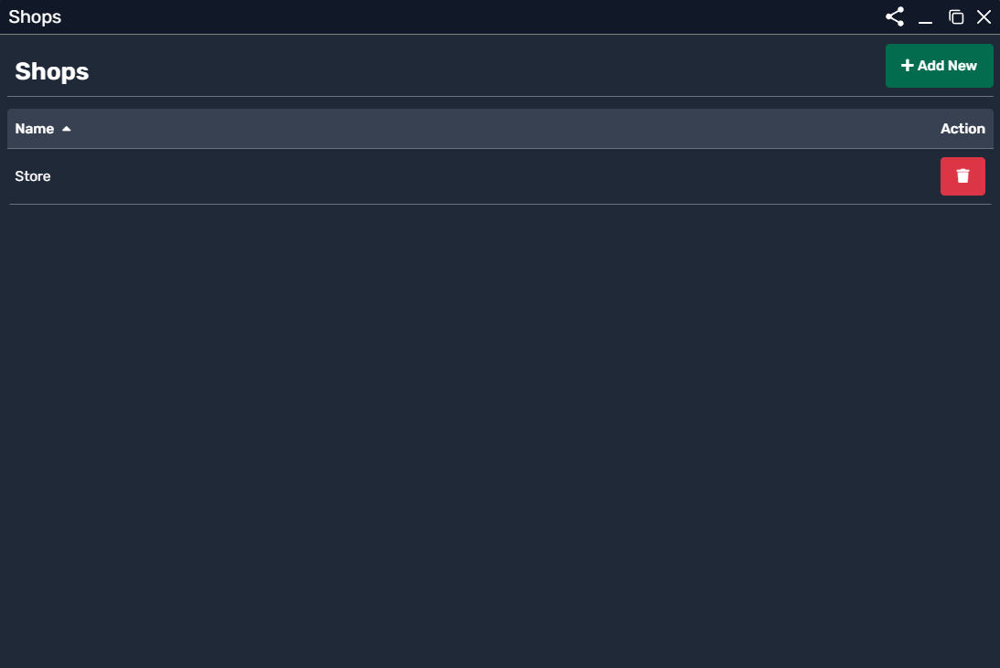
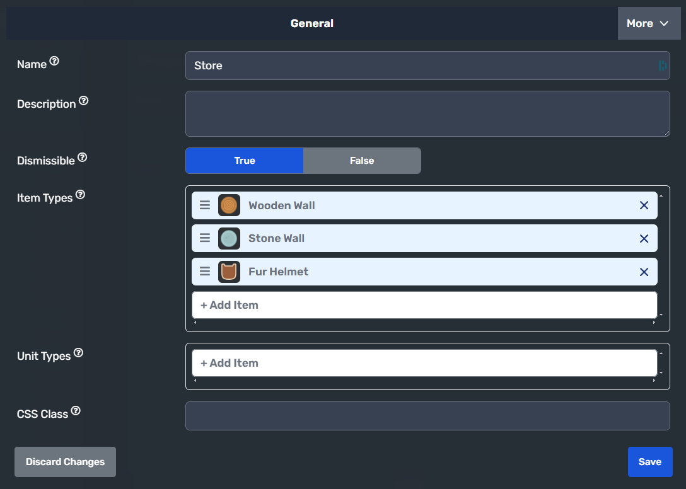
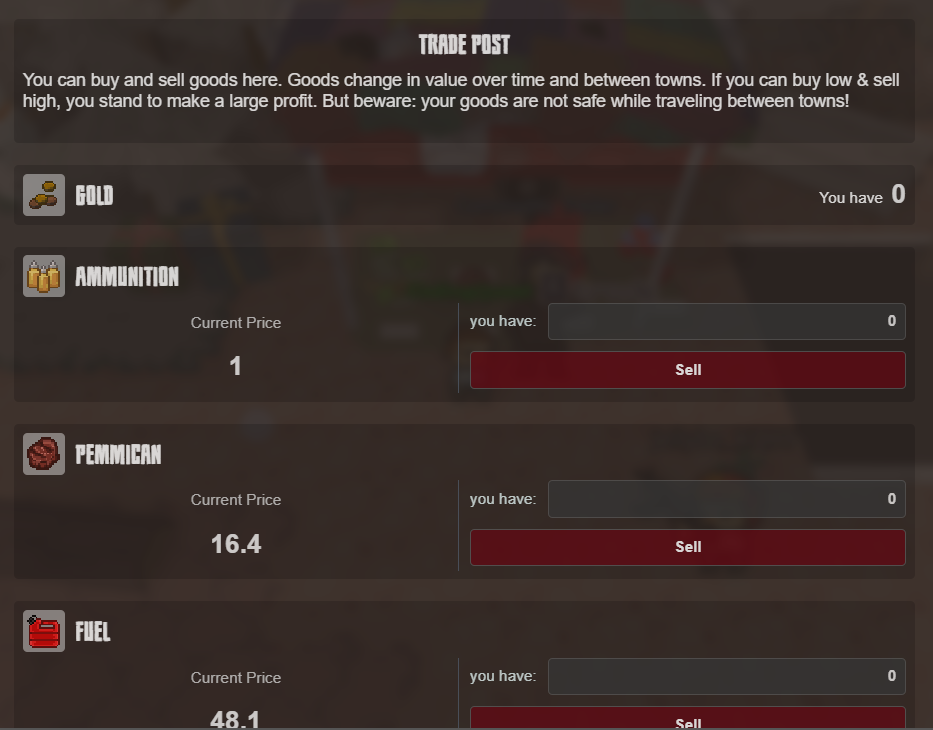

# Shop System

Shops in the game allow players to **purchase items** such as weapons, tools, consumables, or materials. They serve as an essential part of the economy, enabling **trading, upgrading, or acquiring necessary resources**.

## Shop Overview

A shop is a **point of interaction** where players can browse and buy items from a predefined list. Each shop is **customizable** and can include **different items, restrictions, and UI elements**.

### Viewing Shops
To view the available shops, navigate to the **Shops Panel**, as shown below:

  

The **Shops Panel** displays all existing shops in the game. Each shop has:
- **A unique name** for easy reference.
- **A list of items available for purchase**.
- **An action button** to edit or delete the shop.

---

## Creating a New Shop

To create a new shop:
1. Click the **"Add New"** button.
2. Define the shop's **name**, **description**, and **item Yupes**.
3. Configure additional settings.

Upon creating a new shop, you will see the following interface:

  

---

## Shop Settings

### General Properties
| Property         | Description |
|-----------------|-------------|
| **Name**        | The shop's name displayed in the UI. |
| **Description** | A short description of the shop (optional). |
| **Dismissible** | Determines whether the shop can be closed freely. |

---

### Item Management
Each shop allows you to **define what items it sells**. The **Item Types** section includes a list of **all available items** in the shop.

| Setting      | Description |
|-------------|-------------|
| **Item Types** | Lists the items available for purchase. |
| **Add Item** | Allows adding more items to the shop. |
| **Remove Item** | Deletes an item from the shop’s inventory. |

Example of an item list:
- **Wooden Wall**
- **Stone Wall**
- **Fur Helmet**

---

### Unit Types (Shop Availability)
Shops can be restricted based on **unit types**. This setting determines **who can access the shop**, allowing only **specific units or roles** to interact with it.

| Setting       | Description |
|--------------|-------------|
| **Unit Types** | Defines which units can use the shop. |

---

### CSS Class (Advanced Customization)
The **CSS Class** setting allows developers to **apply custom styling** to a shop, modifying its **appearance and behavior**.

---

## How Shops Work in Gameplay
- Players can **interact with a shop** by clicking on it.
- If the player **meets the conditions**, they will **see a list of available items**.
- Players can **purchase items** using the in-game currency or resources.
- Some shops may have **limited inventory**, restricting purchases based on item availability.

---

## Example Shop

Here’s an example of a **Trade Shop** displayed from **Doomr.io** when the player joins:

  

---
## Summary
- **Shops are interactive points for buying and selling items.**
- **Each shop has a name, description, and a list of items it sells.**
- **Shops can be customized to allow specific units to access them.**
- **Items can be freely added or removed from the shop's inventory.**
- **Customization is possible via CSS for advanced UI design.**

By using the **Shops System**, you can create a **dynamic economy** within your game, giving players the ability to acquire **important resources, upgrades, and weapons**.
