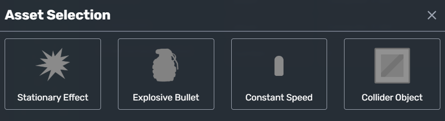
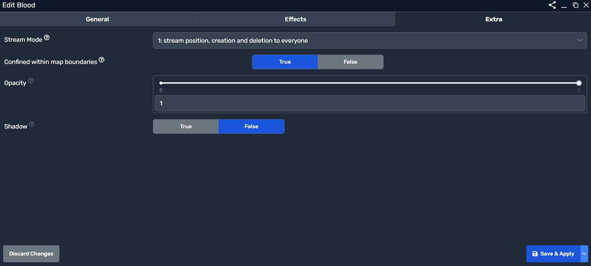

# Projectiles System

Projectiles in the game are **dynamic objects** that can be used for various effects, such as bullets, explosions, or environmental interactions. They are crucial for **combat mechanics, physics-based interactions, and visual effects**.

## Projectile Overview

A **projectile** is an independent entity that moves through the game world after being spawned. It can have different properties like **speed, collision behavior, effects on impact, and lifespan**.

### Viewing Projectiles
To view and manage projectiles, navigate to the **Projectiles Panel**, as shown below:

  

The **Projectiles Panel** displays:
- **A list of existing projectiles** in the game.
- **The ability to create new projectiles**.
- **Edit and configure projectile properties**.

---

## Creating a New Projectile

To create a new projectile:
1. Click the **"New"** button in the projectiles section.
2. Select **Projectile Type**.
3. Configure the **settings, animations, lifespan, and physics**.

Upon creation, the following **Asset Selection** window appears:

  

---

## Projectile Types

When creating a projectile, you must **choose an asset behavior**:

| Type | Description |
|------|-------------|
| **Stationary Effect** | Stays in one place upon spawning (e.g., explosion). |
| **Explosive Bullet** | Creates an area-of-effect explosion upon impact. |
| **Constant Speed** | Moves at a fixed speed (e.g., bullets, arrows). |
| **Collider Object** | Behaves as a physics-based object upon impact. |

---

## General Projectile Settings

Once a projectile is created, you can configure its **basic properties**:

  

| Setting | Description |
|---------|-------------|
| **Name** | The name of the projectile (e.g., "Blood", "Fireball"). |
| **Inventory Icon** | Optional UI icon for visibility. |
| **Attributes** | Custom stats for the projectile (e.g., damage, speed). |
| **Variables** | Stores additional data. |
| **States** | Defines the different states of the projectile. |
| **Animations** | Allows setting animated visual effects. |
| **Body Types** | Determines collision behavior (e.g., solid, pass-through). |
| **Lifespan** | Duration before the projectile disappears. |

---

## Projectile Effects

Projectiles can **trigger effects** upon creation, impact, or destruction.

  

| Effect Type | Description |
|------------|-------------|
| **On Create** | Effects triggered when the projectile spawns. |
| **On Destroy** | Effects triggered when the projectile disappears. |
| **Projectile Type** | Defines what kind of projectile effect is applied. |
| **Sound** | Plays a sound upon trigger. |
| **Animation** | Triggers an animation upon effect activation. |
| **Run Script** | Executes a script when the effect is triggered. |

Example: A **grenade** projectile may **play an explosion sound and animation upon impact**.

---

## Extra Projectile Settings

Projectiles can have **streaming behaviors, collision constraints, and transparency**.

  

| Setting | Description |
|---------|-------------|
| **Stream Mode** | Determines how the projectile syncs across multiplayer. |
| **Confined within Map Boundaries** | Restricts movement within the level. |
| **Opacity** | Controls transparency of the projectile. |
| **Shadow** | Enables or disables shadow rendering. |

---

## How Projectiles Work in Gameplay
- When a **weapon is fired**, it spawns a projectile.
- Projectiles **move based on their speed and physics settings**.
- Upon impact, they may **deal damage, trigger effects, or disappear**.
- Some projectiles **persist in the game world** (e.g., traps, obstacles).

---

## Summary
- **Projectiles are dynamic objects used for weapons, effects, and physics.**
- **Each projectile has a behavior type: bullets, explosives, or static effects.**
- **Effects can trigger on create, impact, or destruction.**
- **Customization includes speed, animations, physics, and visual settings.**
- **Advanced settings enable multiplayer sync and transparency control.**

By using the **Projectiles System**, you can enhance your game’s **combat mechanics, physics-based interactions, and immersive effects**. 🚀
