# Your First 2D Game: Wilderness Survival

In this tutorial, you'll create a complete hunting and gathering game using Moddio's template system. By the end, you'll have a game with:

- Player movement and combat
- AI predators (Bear) and prey (Wild Boar)
- Resource gathering and loot drops
- Health system and blood effects
- Functional weapons shop
- Basic survival mechanics

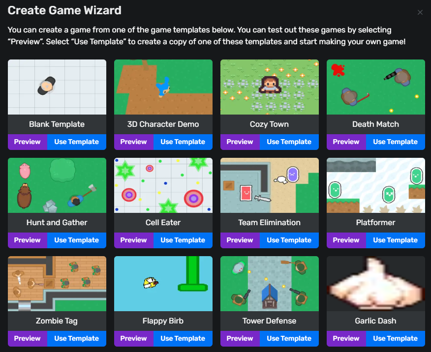

## Prerequisites
- Basic understanding of Moddio Editor
- The "Wilderness Survival" template installed
- Familiarity with visual scripting concepts

## Contents
1. [Project Setup](#project-setup)
2. [Player Character Configuration](#player-character)
3. [Combat System](#combat-system)
4. [AI Behavior Configuration](#ai-configuration)
5. [Loot System](#loot-system)
6. [Shop Implementation](#shop-integration)

---

## 1. Project Setup 

Start with the pre-built template:
1. Create New Project → Templates → "Blank Template"
2. Explore initial components:
   - `Homie` In `Units` folder (character controls)
   - `Items` folder
   - `Projectiles` folder
   

  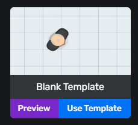
   <em>Blank Template Game</em>

---

## 2. Player Configuration 

### Movement Setup
1. Open *Homie Controller*
2. Navigate to *Controls Settings*
3. Explore Settings

  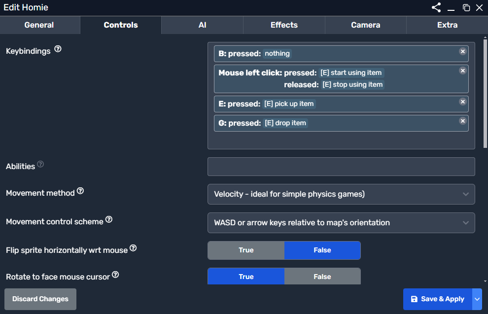
   <em>Movement configuration panel</em>

---

## 3. Combat System 

1. **Weapon Configuration**
   - Create *Items/Weapons* folder
   - Create *Melee Weapon Item*
   - Select weapon to modify
   - Adjust damage values in properties panel

  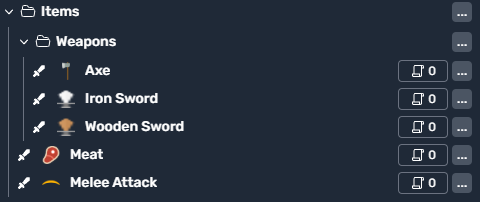
   <em>weapon configuration</em>

  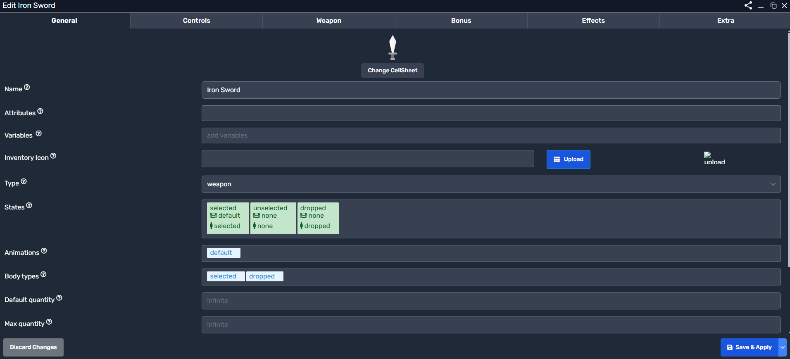
   <em>weapon configuration</em>

  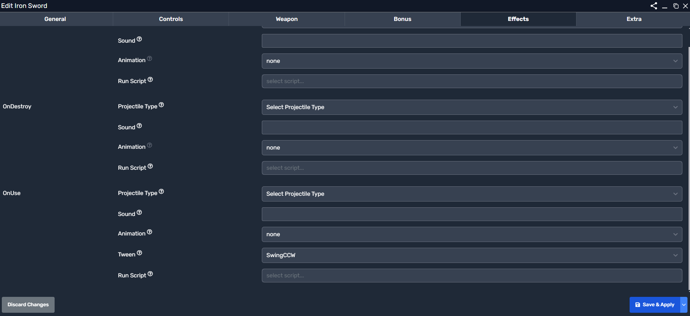
   <em>weapon configuration</em>

---

## 4. AI Configuration 

### Bear (Predator)
1. Open *AI/Animals/Bear*
2. Set behavior parameters:
   - Enable AI: *True*
   - Sensor Radius: *150px*
   - Idle Behavior: *Wander*

  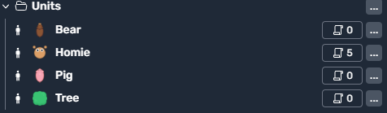
   <em>AI configuration</em>

  
   <em>AI configuration</em>

### Pig (Prey)
1. Open *AI/Animals/Pig*
2. Configure flee behavior:
   - Enable AI: *True*
   - Sensor Radius: *150px*
   - Idle Behavior: *Wander*

  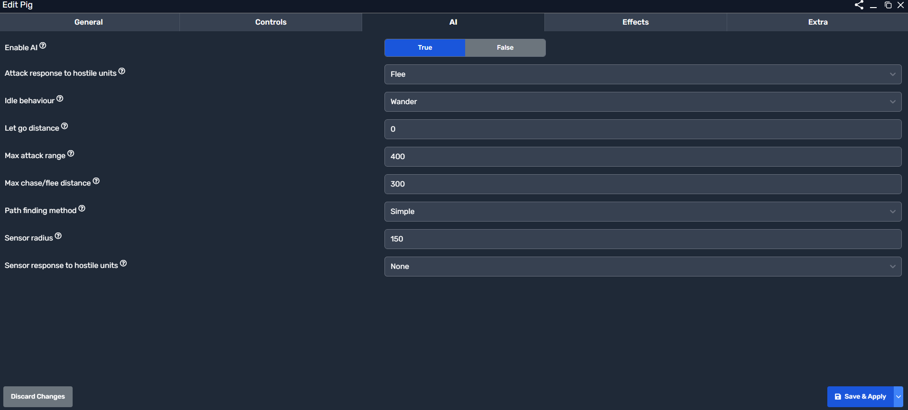
   <em>AI configuration</em>

### Spawn Units
1. Open *World Script*
2. Configure Script:

  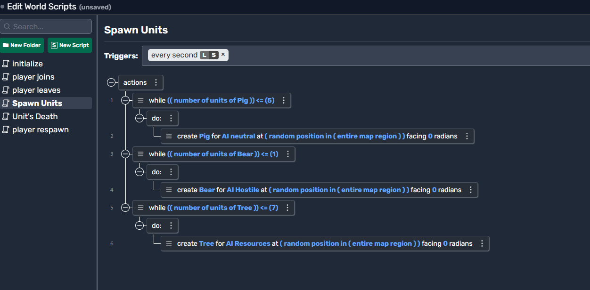
   <em>AI configuration</em>

---

## 5. Loot System 

1. Open *Items* folder
2. create an item you want
3. write a script so units drop this item

  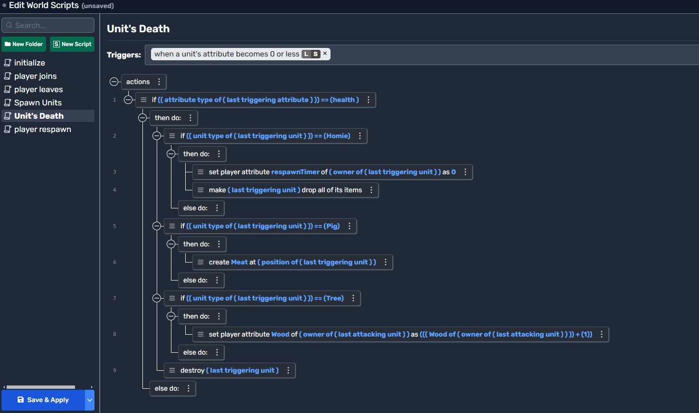
   <em>Loot table interface</em>

---

## 6. Shop Setup 

1. Create New Shop:
   - Right-click *Shops* folder
   - Select "Add New"

2. Add Shop Items:
   - Click *Add Item* in the "Item Types" section
   - Set prices in the item

  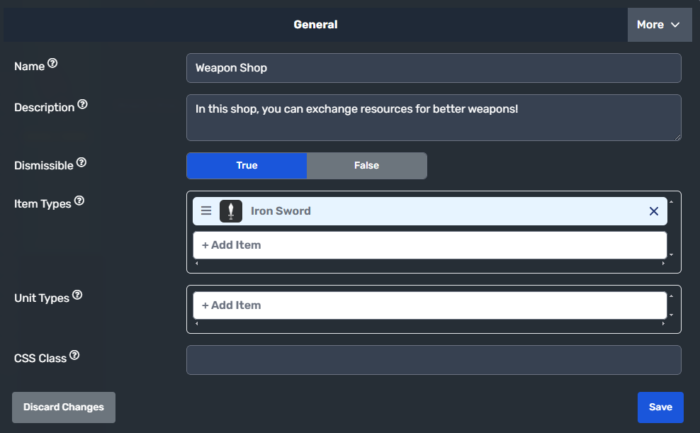
   <em>Shop inventory management</em>

---

# Next Steps
- [Video Tutorial: Full Setup Walkthrough](https://www.youtube.com/playlist?list=PLNN5LDYTMuZgfDOXHXaFB7jXmB-N8UrXZ)
- Experiment with different animal behaviors
- Create weapon upgrade paths
- Create an NPC to open the shop