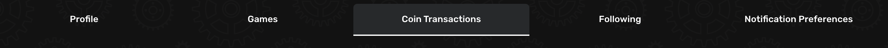

# Introduction to Modd Coins

*This page needs help. Find out how to contribute [here](../../how-to-contribute.md)*
## Monetization with Modd Coins

Modd Coins are our in-game currency, and you can use them to monetize your games. You can add skins, items, ads, and more for purchase in your games, and cash out your Modd Coins for real money. Here's how it works:

- Modd Coins for Cash: You earn coins for every transaction within your game, and Moddio takes a 10% transaction fee. You can convert your Modd Coins directly into real money, with a minimum payout amount of $20. Payments are currently made via Paypal, with more payment options coming soon.
- Using Modd Coins in Your Games: Modd Coins are a great way to offer in-game skins and items and make your game more fun and engaging over the long term. You decide how much skins or items sell for, or you can add coin prizes as a way to incentivize players.
- Allow Ads in Your Games: You can add video ads into your games and earn coins. You can specify when they’re shown to players in order to provide the best experience - for example, in between game rounds. This provides another avenue to monetize your games without your players spending money.

## Monetization with Modd Coins

Modd Coins are our in-game currency in Moddio. They can be used by players for buying items and cosmetics in Moddio games. Creators can use Modd Coins to add exclusive experiences to their games and to provide incentives for players to earn Coins.  
Because they can be cashed out for money, Modd Coins are the primary way for creators to monetize their game creations. Here's how it works:

- **Modd Coins for Cash:** You earn coins for every transaction within your game, and Moddio takes a 10% transaction fee. You can convert your Modd Coins directly into real money, with a minimum payout amount of $20. Payments are currently made via Paypal, with more payment options coming soon.
- **Using Modd Coins in Your Games:** Modd Coins are a great way to offer in-game skins and items and make your game more fun and engaging over the long term. You decide how much skins or items sell for, or you can add coin prizes as a way to incentivize players.
- **Allow Ads in Your Games:** You can add video ads into your games and earn coins. You can specify when they’re shown to players in order to provide the best experience - for example, in between game rounds. This provides another avenue to monetize your games without your players spending money.

Modd Coins provide a way to generate income from your creativity and hard work, enriching your game development journey on Moddio.

Remember, these resources and opportunities are created for you. We encourage you to utilize them to enhance your game development skills, contribute to our vibrant Moddio community and create entertaining games that players around the world can enjoy. We look forward to seeing what you create!

## How to Cash Out
You can find the option to cash out by going to the top right corner where your User Profile picture is. Click that and go to **Settings**. You will see a tab called **Coin Transactions**.

If you have enough Modd Coins to cash out, you will be able to click on the **Request Payout** button and request a payout.
=======
If you have enough Modd Coins to cash out, you will be able to click on the **Request Payout** button and request a payout.

## Uses for Modd Coins

### Unit Skins

Players can spend Modd Coins to purchase unit skins in games and equip them. This will make the unit they control appear with the sprite of the equipped skin while playing the game. Since this change only affects the sprite of a player, it does not give anyone a direct gameplay advantage. 

Creators can offer different skins for each controllable unit type that exists in the game. If you have a look at Braains for example, you can see that 4 types of skin are offered in the skin shop (Human, Sick, Zombie, Zombie King):

The skin shop also contains a link to the skin submission page. This page allows any player to submit their own skin creations. After the creator accepts a skin submission, the skin can be bought by anyone in the skin shop. The earnings from selling skins are split between both parties. 

Each transaction has a **10% fee**, so if the creator splits the earnings with the skin creator they both receive **45% of the Modd Coins spent on unit skins**. A creator that submits their own unit skin receives **90% of the Modd Coins**. 

### Game Items

Once a game reaches advanced tier, creators can charge Modd Coin for items they are selling in shops. It's up to the creators to decide what the benefit of these items is. In [Karmaslayers](https://www.modd.io/play/karmaslayers), players can purchase crafting materials, powerful items and strong single-use items like Rebirth:

Game items often give players a direct advantage, like increasing their point game or giving them earlier/exclusive access to a strong item. It is also possible to sell cosmetic game items.

Since each transaction has a 10% fee, creators **receive 90% of the Modd Coins spent on game items**. 

### Script Actions

Games with advanced tier also have access to script actions that send Modd Coins. With these script actions, it's possible to reward players with coins for completing certain actions in game. Some example uses of coin script actions:
* coin reward for being the first to complete a stage  
* coin reward for completing a daily quest  
* converting earned ingame premium currency back to modd coins

*Script Reference:*   
> [send Modd Coins to player (player pays fee)](https://www.modd.io/docs/functions/sendCoinsToPlayer)  
> [send Modd Coins to player (owner pays fee)](https://www.modd.io/docs/functions/sendCoinsToPlayer2)  

*Trigger Reference:*  
> [when coins are sent to a player successfully](https://www.modd.io/docs/triggers/sendCoinsSuccess)  
> [when sending coins to player fails (coin limit exceeded)](https://www.modd.io/docs/triggers/coinSendFailureDueToDailyLimit)  
> [when sending coins to player fails (creator lacking balance)](https://www.modd.io/docs/triggers/coinSendFailureDueToDailyLimit)  

### Creator Coin Purchase Bonus

The final way to earn Modd Coins is with the 5% bonus a creator receives each time Modd Coins are bought in their game. So if a player decides to purchase 1000 Modd Coins while playing Karmaslayers, the creator of that game receives 50 Modd Coins right away, without any skin or item purchase needed.