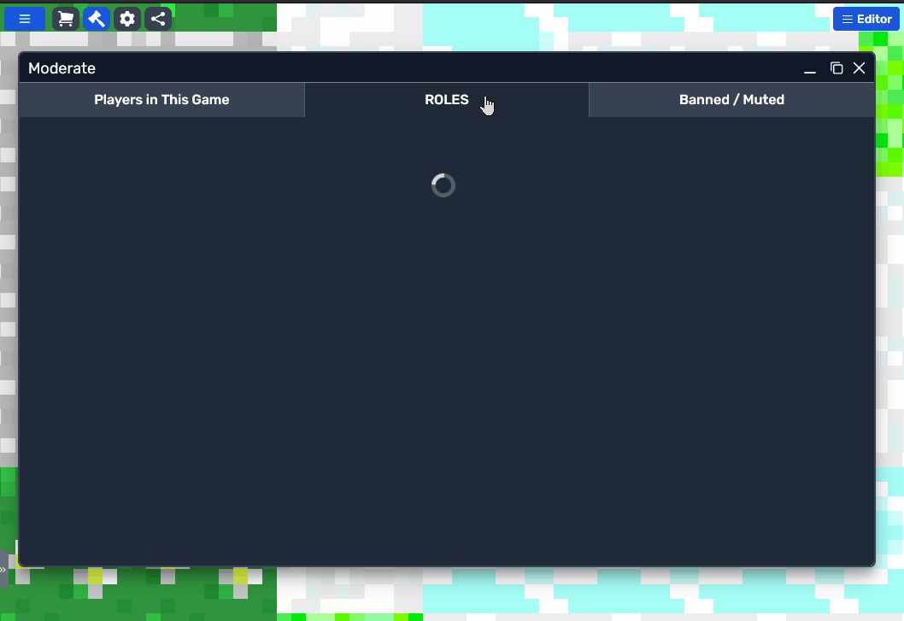
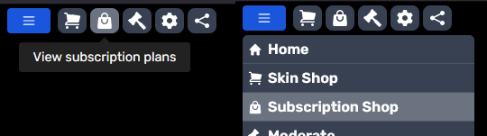

# Subscriptions Overview

Subscriptions offer a streamlined way for game creators on Modd.io to generate a steady revenue stream, moving beyond one-time purchases to a model that provides monthly income.  
This setup not only supports creators financially but also enables players to invest in their favorite games for ongoing benefits.

## Requirements

Just like with purchasable skins and premium items, your game needs to be advanced tier.

## Advantages for Creators and Players

- **Creators** gain a monthly income, aiding in the game's continuous development and reducing reliance on Modd coin purchases which fluctuate more.
- **Players** receive unique in-game perks, adding more fun while allowing them to support the creators they love.

## Setting Up a Subscription Role

To introduce a subscription model in your game, start by establishing a subscription role:

1. **Create a Role:** In the moderation window on Modd.io, create a role that will be tied to subscribers.

2. **Activate Subscription:**
   - Access the subscription tab in your dashboard.
   - Turn on the subscription option for your newly created role.
   - Determine a monthly subscription fee.
   - Craft a compelling description highlighting subscriber benefits.
   - Upload an engaging image to represent your subscription in the shop.

After completing these steps, your subscription will be available in the subscription shop. The subscription shop can be accessed in the main hamburger menu or via the shop quick access button

## Implementing In-Game Benefits

Offering tangible benefits for subscribers is crucial. Assign the subscription role to players upon purchase, keeping their benefits active as long as the subscription lasts. Utilize an `if statement` in your scripts to verify a player's subscription status through the [`roleExistsForPlayer`](https://www.modd.io/docs/variables/roleExistsForPlayer) boolean variable.

### Recommended Subscriber Perks

Here's a few suggested subscriber perks:

- **Daily Rewards:** Exclusive rewards provide an incentive to return every day which also helps with player stickyness.
- **Ad-Free Gameplay:** If your game relies on advertisements, create a plan that removes ads.
- **VIP Access:** Design special game areas or features that are only accessible to subscribers.