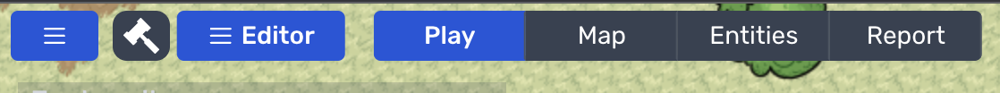
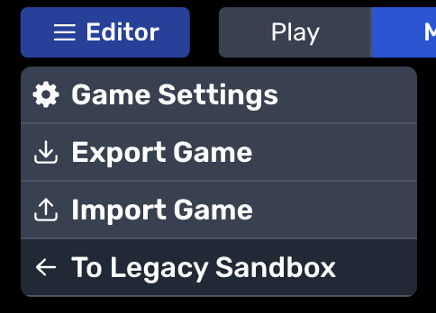
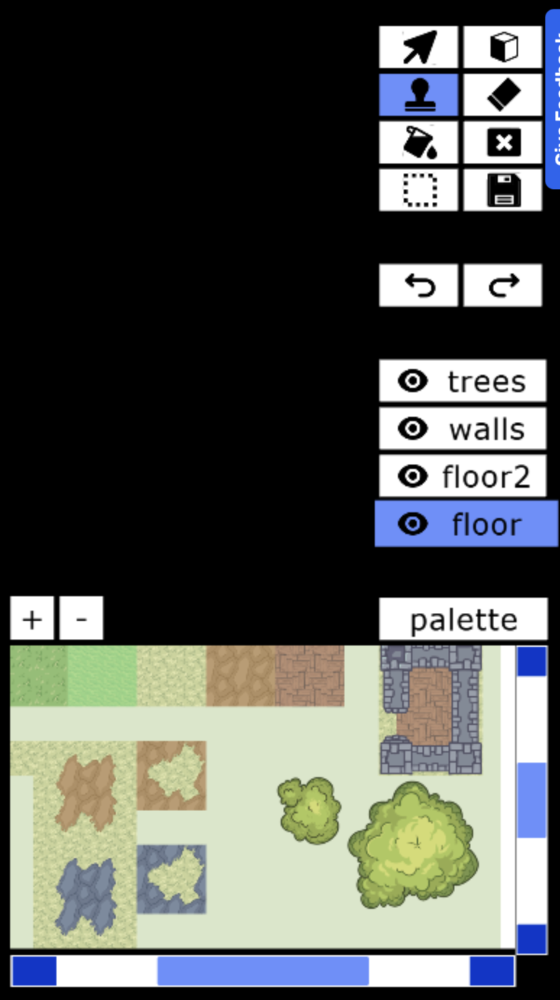
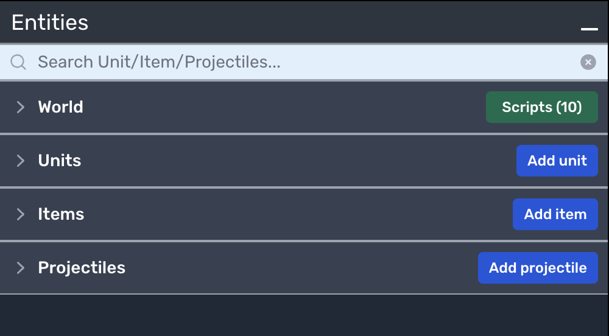
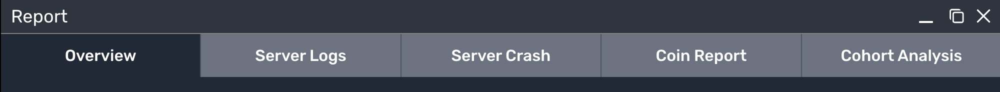

# Interface

The core Moddio interface is the same no matter which template you use. After you go to Moddio, go to **Create** to make a new game. Then, click the **Create a new game** button, and select your template. YOu will then enter the game and load the game editor. 

By default, you will enter Moddio in Play mode. However, as owner of the game, you will have several UI options that are not available to players. At the top of the game screen, you will see a navigation bar in the center of your window. The bar consists of Editor, Play, Map, Entities, Moderate, Report, and the Publish/Republish button.

We will go more in-depth of each button later. For now, the primary workspaces are as follows:
*   **Editor**
    *   This drop-down menu presents options to Export and Import JSON and access Settings. In addition, users can access the legacy sandbox by navigating to this drop down menu.
    
    

*   **Map**
    *   This workspace gives access to map editing tools. The Map Editor currently includes the Cursor, Entities, Stamp Brush, Eraser, Bucket, and Region tools and then a layer selection. The Palette below that is sourced from the Settings of the game and presents all tiles available in the currently selected tilesheet to build the map.
    
    
    
   **Tools and Size Buttons**

    *   The **Cursor Tool** allows you to interact with any regions or entities on the map with a **Left Click**.

    *   The **Entites Tool** allows you to interact with the entities on the map. If you select this tool, a list of all your entities will pop up. You can click on the list to select an entity, and then click on the map to drop it in place. If you then select the **Cursor Tool**, you can click and drag a corner up or down to change the entity size. This makes it very easy to add entities to your map

    *   The **Stamp Brush** acts like a brush. It allows you place your current selected tile selection on the Map with a **Left Click**. You can use Alt + Wheel scroll to change the size of your stamp.

    *   The **Eraser** erases your current tile selection. It's useful for removing tiles.

    *   The **Region Tool** allows you to create regions. These can be used in Scripts, such as allowing actions and events to occur within defined regions.

*   **Layer Toggle** is under the tools. Layers are ordered from top to bottom, so Trees are always on top of Walls and the Floor layers.  You can switch layers by clicking on the layer of your choice. You are always working on the selected layer and any changes using the tools will occur on that layer.

*   **Tile Picker** is in the bottom corner. You can toggle the Tile Picker on or off by clicking on **palette** or pressing the **tab** key. When expanded, you can select tiles within the palette to place on the map.

**Right click** on the map will copy the tiles your cursor is currently on top of, including any empty tiles.

*   **Entities**
    *   Entities are organized into World, Units, Items, and Projectiles sections. In this interface, you will be able to edit the properties, scripts, and cellsheets of anything generated in your game. In addition, this workspace allows you to add additional Entities into the game and script each one individually. This is where the majority of creating and building your game occurs.

    

*   **Report**
    *   You'll see this window split into tabs for Overview, Server Logs, Server Crash, Coin Report, and Cohort analysis. This allows you to view data about your game's performance and stats. You'll also see how many coins you've earned from the game.
    
    

