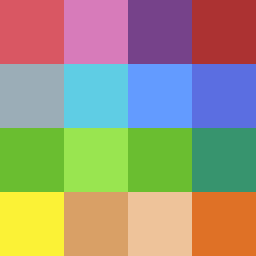
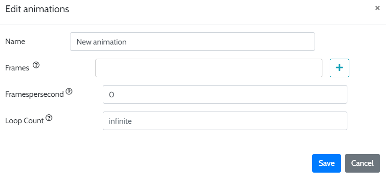

# Animations

By using a cell sheet with multiple frames, we can customize different animations for our entities. There are important settings on the interface **Upload from computer** when you select ```Change CellSheet``` on an entity's **General** settings tab. These are ```Column Count``` and ```Row Count```. Let's look at an example image.



This image is ```256``` by ```256```. If we set the column and row counts to ```1```, the entity will have a sprite with just one frame, all 16 colored squares. For animations, we can slice the image into equally sized 'frames'. The colored squares that make up this example are used to illustrate a cell sheet we have uploaded that we intend to divide up into unique frames.

To do this, we set the ```Column Count``` and ```Row Count``` values to ```4```, telling the editor that this image should be separated into four columns and four rows of images. It is very important that the dimensions of the source image we upload are equally divisible by the number of columns and rows. Since the source here is 256 by 256 and there are 4 columns and rows, the editor will have no problem dividing it into 16 individual ```64``` by ```64``` image frames. However, if we tried to use the same settings on a cell sheet that has dimensions of 300 by 300, our frames will be distorted, not cleanly displaying the separate colored squares.

Now that we have a cell sheet for our entity, we can use its individual frames to create animations. Below is an image of the interface when we select ```Add new animation``` from the drop-down list found on the **Animations** setting of an entity.



As with every setting we add to the game, providing a descriptive ```Name``` allows us to keep track of what the animation does. Additionally, animations can be changed through scripts and entity effects. They are accessed by their ```Name```.

The ```Frames``` setting displays all of the frames that have been added to this animation. The order here matters. Animations will play the frames in this list from left to right. Clicking the ```+``` button on the right will bring up a window with an image of the entire cell sheet called ```Select Cell Image```. Depending on how the source image was divided into frames, hovering over different parts of the image will highlight the individual frame. This can be a good way to see how the ```Column``` and ```Row``` count settings have cut up the source image.

When a frame is selected, a preview image and frame number are added to the **Frames** setting


