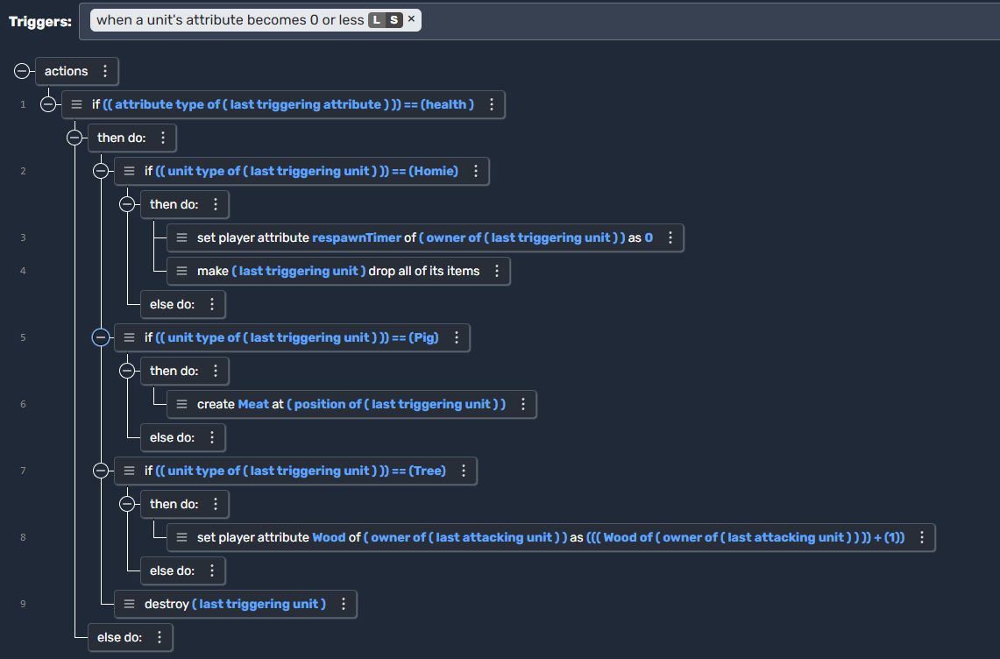

# Actions in Moddio

**Actions** are the fundamental building blocks of game logic in **Moddio**. They define **what happens** after a **trigger** is activated. Actions allow you to modify game elements, create interactions, and define behaviors for units, items, and the world.

---

## What Are Actions?

Actions are **commands** that execute when a trigger is activated. They define the **response** to an event. Examples of actions include:
- Creating or destroying objects
- Modifying player attributes (e.g., health, speed)
- Moving or rotating entities
- Running scripts dynamically

Each action **executes in sequence**, from **top to bottom**.

---

## How to Use Actions

1. **Choose a Trigger** – Actions always execute inside a **trigger**.
2. **Add Actions** – Select an action from the editor’s list (e.g., “Destroy Unit”).
3. **Set Parameters** – Most actions require parameters like **target entities, numerical values, or map regions**.
4. **Test the Script** – Run the game and observe the behavior.

---

## Types of Actions

### **1. Entity Manipulation**
Actions that **create, move, or destroy entities** in the game.

| Action            | Description |
|------------------|-------------|
| **Create Entity** | Spawns a unit, item, or projectile at a specified location. |
| **Destroy Entity** | Removes an entity from the game world. |
| **Move Entity** | Changes the position of an entity to a new location. |
| **Rotate Entity** | Rotates an entity to a specified angle. |

---

### **2. Attribute Modifiers**
Actions that **change entity attributes** such as health, stamina, or other stats.

| Action                 | Description |
|-----------------------|-------------|
| **Set Attribute** | Assigns a specific value to an entity’s attribute. |
| **Increase Attribute** | Adds a value to an attribute (e.g., `health +10`). |
| **Decrease Attribute** | Subtracts a value from an attribute (e.g., `stamina -5`). |

Example:  
- **Trigger:** When a player picks up a health potion  
- **Action:** Increase player’s **health** by **50**

---

### **3. Player & Unit Controls**
Actions that **modify player behavior** and **unit interactions**.

| Action               | Description |
|---------------------|-------------|
| **Set Camera Target** | Focuses the player's camera on a specific unit or object. |
| **Disable Player Control** | Prevents the player from moving or interacting. |
| **Force Player Movement** | Moves the player to a set position automatically. |

Example:  
- **Trigger:** When a player dies  
- **Action:** Set the **camera target** to a newly spawned character

---

### **4. Inventory & Items**
Actions that **add, remove, or manage items** in an entity’s inventory.

| Action            | Description |
|------------------|-------------|
| **Give Item** | Adds an item to a unit's inventory. |
| **Remove Item** | Deletes an item from a unit's inventory. |
| **Drop Item** | Makes the unit drop an item at its position. |

Example:  
- **Trigger:** When a player picks up an apple  
- **Action:** Add `Apple` to the **player’s inventory**  

---

### **5. Visual & UI Effects**
Actions that **display text, animations, or special effects**.

| Action               | Description |
|---------------------|-------------|
| **Show Floating Text** | Displays a message above an entity. |
| **Play Animation** | Triggers a predefined animation for a unit. |
| **Shake Screen** | Creates a screen shake effect for impact. |

Example:  
- **Trigger:** When an enemy dies  
- **Action:** Show floating text `"Enemy Defeated!"` above the unit

---

### **6. Advanced Scripting Actions**
Actions that **modify scripts dynamically** or **trigger additional events**.

| Action               | Description |
|---------------------|-------------|
| **Run Another Script** | Calls another script from within the current one. |
| **Loop Actions** | Repeats an action multiple times. |
| **Conditional Check (If/Else)** | Executes different actions based on conditions. |

Example:  
- **Trigger:** Every second  
- **Action:** If **enemy count < 5**, spawn a new enemy.

---
## Example: Unit Death and Resource Drop

One of the most common uses of Actions is handling **unit deaths**. Below is an example script where different unit types trigger unique Actions when they die.

  

### **How This Works**
1. **Trigger:** A unit’s **health** reaches **0**.
2. **Action:** The script checks the unit type:
   - **Homie:** Sets a respawn timer and drops all items.
   - **Pig:** Spawns **Meat** at its location.
   - **Tree:** Grants **Wood** to the attacking player.
   - **Default:** The unit is **destroyed**.

This is an example of **conditional Actions**, where different events occur based on unit type.

---

## Running Actions: Server vs. Local

Actions can be configured to **run on the server or locally**. This is useful for optimizing game performance.

| **Execution Type** | **Behavior** |
|------------------|-------------|
| **Server (S)** | Runs the action on the game server. Used for global effects like spawning enemies or changing attributes. |
| **Local (L)** | Runs the action **only for the player**. Useful for UI updates or local animations. |

Using **Run On...**, developers can control where each action executes.

## 🔗 Continue Learning
- **[Triggers →](using-scripts/script-editor/triggers.md)**
- **[Unit Scripts →](using-scripts/script-editor/unit_scripts.md)**
- **[Item Scripts →](using-scripts/script-editor/item_scripts.md)**
- **[Projectile Scripts →](using-scripts/script-editor/projectile_scripts.md)**
- **[Run On... →](using-scripts/script-editor/run-on.md)**
