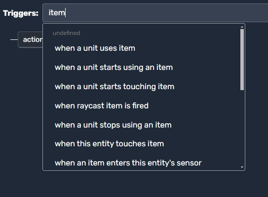
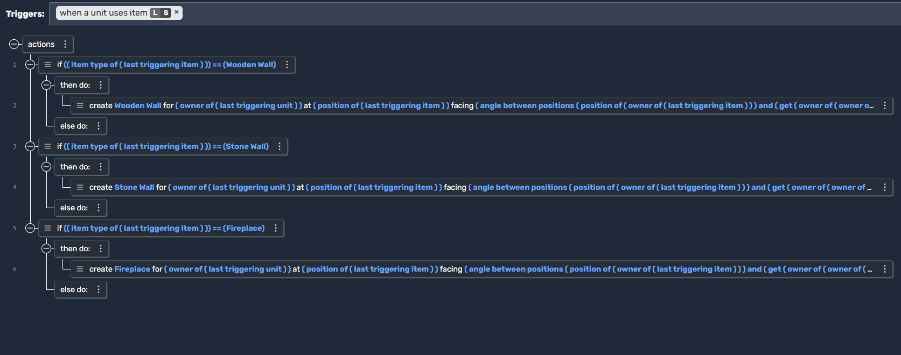

# Item Scripts

In Moddio, **Item Scripts** allow you to define how Items behave and react to events in your game. Much like Unit Scripts, you can respond to triggers such as when an Item is **used**, **touched**, or **destroyed**. Below, we’ll explore:

1. **Where to attach Item scripts**  
2. **Common triggers** you can use  
3. **Examples** of practical scripting scenarios

---

## Attaching a Script to an Item

There are two main approaches to creating scripts for Items:

1. **Item Script (via Editor)**  
   - In the **Game Editor**, select or create a new **Item** type.  
   - Navigate to the **Scripts** (or similarly named) tab, where you can add item-specific triggers.

2. **Global Scripts Affecting Items**  
   - Alternatively, you can place your logic in a **Global Script**, then choose triggers that reference Items (for example, “when a unit uses item”).  
   - This method is especially useful if your logic applies to all items of a certain tag or category.

Either method lets you add triggers and actions to define how your Items behave in various situations.

---

## Triggers for Item Scripts

When creating or editing a script, you’ll see a **“Triggers”** dropdown. You can filter by typing “item” to find triggers related to Items. Here’s an example:

  

> *Example:* Searching “item” in the trigger field might display “when a unit uses item,” “when a unit starts using an item,” “when a unit starts touching item,” etc.

---

## Common Item Triggers & Use Cases

Below is a list of triggers you might encounter when scripting Items. Each bullet includes a use case showing how it could enhance your gameplay:

1. **when a unit uses item**  
   - **Use Case**: Activate a potion effect, fire a projectile, or place a structure (e.g., building a wall).  
2. **when a unit starts using an item**  
   - **Use Case**: Begin a “charging” or “channeling” effect—like drawing a bow or winding up a powerful attack.  
3. **when a unit stops using an item**  
   - **Use Case**: Release the arrow, complete a spell cast, or handle a canceled use if the player interrupts it.  
4. **when a unit starts touching item**  
   - **Use Case**: Auto-pickup logic—if a player walks over coins or power-ups, you can add them to their inventory immediately.  
5. **when raycast item is fired**  
   - **Use Case**: If your item uses a “raycast” mechanic (like a gun or laser), you can detect the firing event to apply damage or effects.  
6. **when a unit stops using an item**  
   - **Use Case**: Similar to above—often used to finalize a channel or usage animation (e.g., finishing a healing potion).  
7. **when this entity touches item**  
   - **Use Case**: Reverse perspective—if your script is on another entity, detect collisions with items (like a conveyor belt picking them up).  
8. **when an item enters this entity’s sensor**  
   - **Use Case**: If you have a special zone or sensor, items crossing the boundary can trigger an event (e.g., a recycling bin that destroys items).

---

## Example: Creating Objects When an Item Is Used

One **common scenario** is to let players build or place objects by using a specific item. Below is a screenshot illustrating a block-style script that checks which item is used and **creates** a corresponding structure:

  

### How It Works 

- **Trigger Condition**: The logic fires whenever a **unit** uses an item.  
- **Item Type Checks**: The script checks the **type** of the item—e.g., `"Wooden Wall"`, `"Stone Wall"`, or `"Fireplace"`.  
- **Object Creation**: Depending on the item type, the game **creates** a new object (like a Wooden Wall) near the using player’s position.  
- **Rotation or Direction**: It optionally sets the created object’s “facing” angle, often based on the player’s facing direction.  
- **Ownership**: The script may assign the newly created object to the same owner as the item or the unit, so you can track which player built it.

This approach enables **building mechanics**, letting players consume an item (e.g., “Wooden Wall blueprint”) to place a structure in the game world.

---

## Practical Item Scenarios

Below are a few ways you might use Item Scripts in your own projects:

1. **Potion & Consumables**  
   - Healing potions, speed buffs, or magical scrolls that apply temporary status effects when used.  
2. **Building & Crafting**  
   - Construction items that place blocks or structures in the world, as shown in the example.  
3. **Ammo & Reloading**  
   - Scripted items that track ammunition counts, triggering reload animations or partial refills.  
4. **Persistent Tools**  
   - Items like pickaxes or fishing rods that can be used repeatedly, each usage detecting collisions or depleting durability.  
5. **One-Time Objects**  
   - Throwable grenades or single-use artifacts that disappear after activation, leaving behind an effect or spawned entity.

---

## Summary

**Item Scripts** empower you to **define unique item behaviors**—from simple one-use consumables to complex building systems. By attaching logic to item-specific triggers, you can control **exactly** how items interact with players, units, and the environment. Combined with **Unit Scripts** and **Global Scripts**, your items can become integral to your Moddio game’s progression, combat, or crafting loops.

## 🔗 Continue Learning
- **[Triggers →](using-scripts/script-editor/triggers.md)**
- **[Actions →](using-scripts/script-editor/actions.md)**
- **[Unit Scripts →](using-scripts/script-editor/unit_scripts.md)**
- **[Projectile Scripts →](using-scripts/script-editor/projectile_scripts.md)**
- **[Run On... →](using-scripts/script-editor/run-on.md)**
