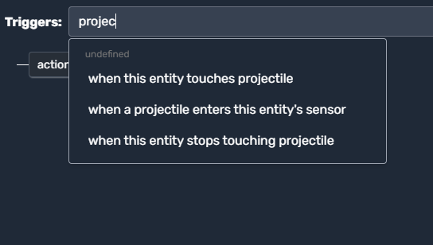
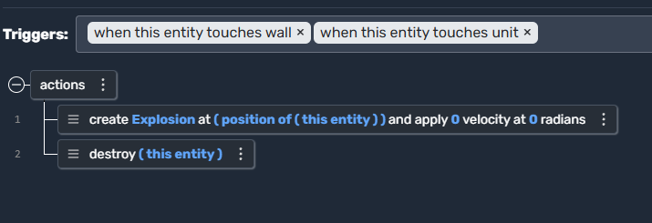

# Projectile Scripts

In Moddio, **Projectile Scripts** define how projectiles behave and interact with the game world. Much like Items and Units, you can respond to various events such as projectiles **colliding** with walls, units, or other objects. Below, we’ll explore:

1. **Where to attach Projectile scripts**  
2. **Common triggers** you can use  
3. **Examples** of practical scripting scenarios

---

## Attaching a Script to a Projectile

There are two primary ways to script your Projectiles:

1. **Projectile Script (via Editor)**  
   - In the **Game Editor**, select or create a new **Projectile** type.  
   - Navigate to the **Scripts** (or similarly named) tab, where you can add triggers specific to that projectile.

2. **Global Scripts Affecting Projectiles**  
   - Alternatively, you can create a **Global Script** and use triggers referencing Projectiles (e.g., “when this entity touches projectile”).  
   - Ideal if you want a broad rule for **all** projectiles in the game, like applying universal collision logic or damage.

Either method lets you define triggers and actions that handle what happens when your projectile strikes a target, enters a sensor, or expires in flight.

---

## Triggers for Projectile Scripts

When creating or editing a script, you can filter by typing “projectile” to find relevant triggers. Here is an example:

  

> *Example:* You might see triggers such as “when this entity touches projectile,” “when a projectile enters this entity’s sensor,” or “when this entity stops touching projectile.”

---

## Common Projectile Triggers & Use Cases

Below are some triggers commonly used for Projectiles, each paired with a short explanation of its use case:

1. **when this entity touches projectile**  
   - **Use Case**: If you’re scripting from the viewpoint of a **Unit** or **Wall**, you can detect when a projectile collides with it—e.g., apply damage or spawn a particle effect.

2. **when a projectile enters this entity’s sensor**  
   - **Use Case**: For advanced detection. If you have a sensor area that picks up any projectile passing through (like a shield bubble), you can block or redirect it.

3. **when this entity stops touching projectile**  
   - **Use Case**: Some scripts might need to handle a “continued contact” scenario (like lingering flames or sticky bombs). Once the projectile is no longer in contact, you can finalize an effect.

4. **when this entity touches wall** (using Projectile Scripts)  
   - **Use Case**: If the projectile hits a wall, you might want to spawn an explosion or destroy it on impact. Perfect for grenades, arrows, or bullets that can’t pass through solid objects.

5. **when this entity touches unit** (using Projectile Scripts)  
   - **Use Case**: Damage logic—like a bullet or arrow dealing hit points to whatever unit it collides with. Alternatively, create a knockback effect or a special status condition (poison, stun, etc.).

---

## Example: Colliding with Walls or Units

Below is a screenshot showing triggers for a projectile that **explodes** and then **destroys itself** upon hitting either a wall or a unit:

  

### How It Works 

1. **Trigger Condition**  
   - The script runs when the projectile **touches** a wall or a unit.
2. **Explosion Creation**  
   - Upon collision, an **explosion** entity is spawned at the projectile’s position, simulating a blast effect.
3. **Projectile Removal**  
   - After creating the explosion, the projectile **destroys itself** so it doesn’t linger in the game world.

This simple logic can be extended to handle different projectile types—for example, sticky mines, bouncing grenades, or piercing arrows that continue traveling after a collision.

---

## Practical Projectile Scenarios

Consider the following applications for your projectile scripts:

1. **Damage & Health**  
   - Reduce a unit’s health on impact, optionally awarding kill credit if health drops below 0.  
2. **Particles & Visual FX**  
   - Spawn sparks, dust, or a flash of light whenever a projectile strikes an object.  
3. **Physics & Trajectory**  
   - Implement bounce or deflection if the projectile hits a surface at a certain angle.  
4. **Expiration Timers**  
   - If a projectile travels for too long without hitting anything, destroy it to prevent an infinite number of objects in the game.  
5. **Special Abilities**  
   - Poison darts, cluster bombs, or magical orbs that create additional projectiles upon impact.

---

## Summary

**Projectile Scripts** are your key to **dynamic combat and interactions**. By handling collisions with walls, units, or sensors, you can make your projectiles explode, bounce, or apply special effects to targets. Whether it’s a simple arrow or a sophisticated guided missile, scripting your projectiles helps ensure each shot feels meaningful and impactful.

### Next Steps

- Try combining these collision triggers with **damage** or **status effects** (e.g., poison, slow, or area-of-effect blasts).  
- Use **tags** or **entity variables** to differentiate projectile types (e.g., “FireArrow,” “IceArrow”), letting them produce unique effects upon impact.  
- Integrate **network syncing** if you want all players to see the projectile’s movement and collision outcomes in real time.

## 🔗 Continue Learning
- **[Triggers →](using-scripts/script-editor/triggers.md)**
- **[Actions →](using-scripts/script-editor/actions.md)**
- **[Unit Scripts →](using-scripts/script-editor/unit_scripts.md)**
- **[Item Scripts →](using-scripts/script-editor/item_scripts.md)**
- **[Run On... →](using-scripts/script-editor/run-on.md)**
