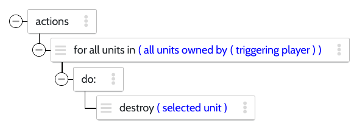
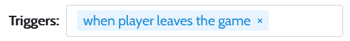
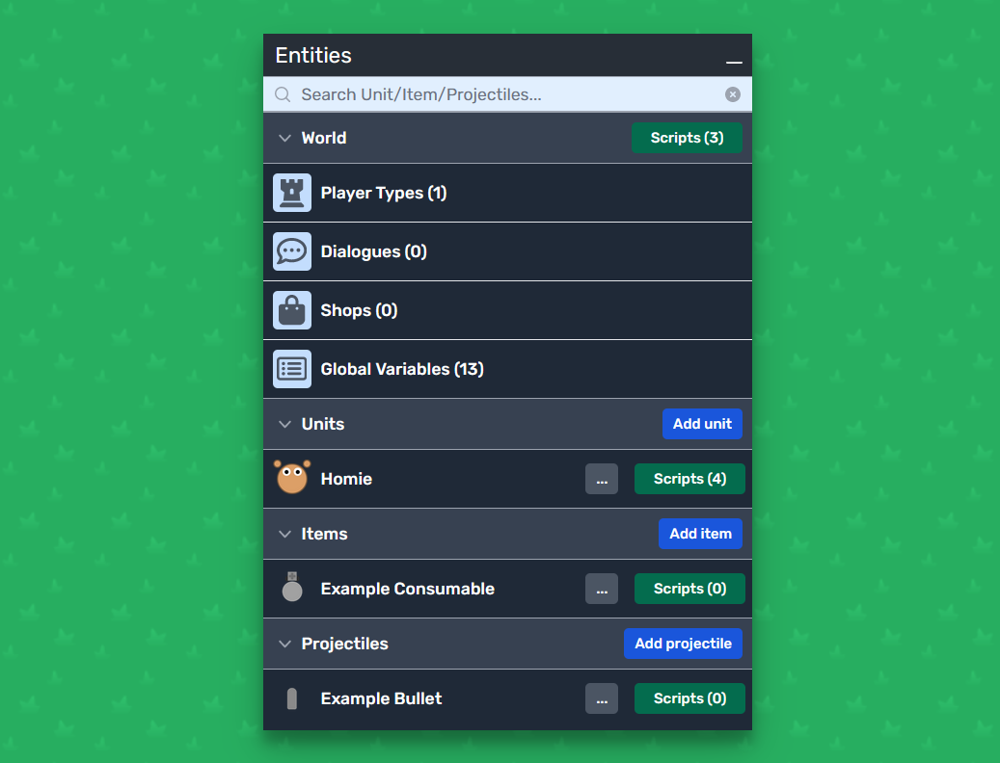
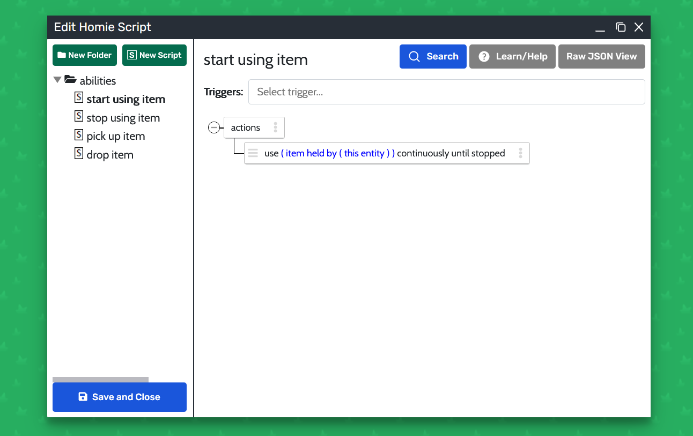
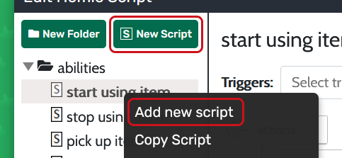
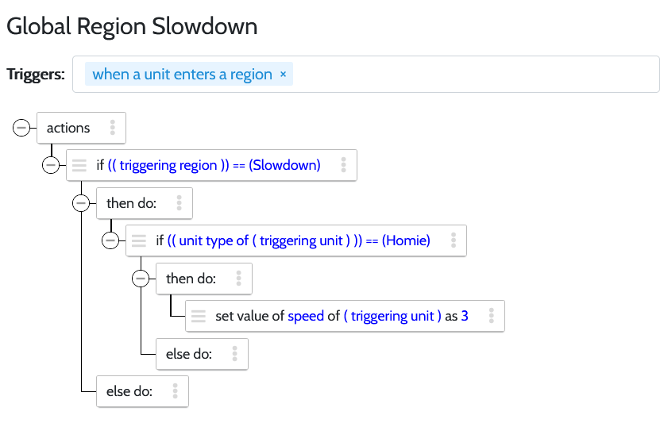
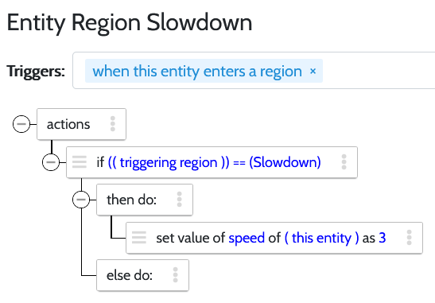

# Script Editor

*This page needs help. Find out how to contribute [here](../../README.md)*

## What is Visual Scripting?

Scripting lets you **add your own custom behavior** to your game, allowing you to create the game interactions needed for your game idea. 

With **visual scripting**, you can define how your game elements should behave without actually writing code. Instead of dealing with complicated code syntax, you use a **visual interface** that lets you connect different blocks (called **actions**) together to create your game logic.

### Actions

Scripts are composed of [actions](https://www.modd.io/docs/functions/). [Actions](https://www.modd.io/docs/functions/) range from simple tasks like *"destroy this entity"* or *"increase \[variable\] value by \[number\]"* to more complex logic like conditionals (["if \[condition\]:"](https://www.modd.io/docs/functions/condition/)) and loops (["while \[condition\]:"](https://www.modd.io/docs/functions/while)). In Taro, script actions run in sequence from top to bottom within their respective script block.

You can look up the available actions and what they do in the [API documentation](https://www.modd.io/docs/functions/).

### Triggers

Taro is using an **event-driven approach** which allows you to add [triggers](https://www.modd.io/docs/triggers/) to scripts. [Triggers](https://www.modd.io/docs/triggers/) are basically events that cause the associated script Actions to run. Here's some examples of common triggers: *"when this entity is created"*, *"when a unit picks up an item"*, *"when player joins the game"*. 

Taro engine automatically checks at every engine step whether a trigger fulfills the conditions, then runs the associated Script. It's also possible to trigger scripts from another script (with the *"Run Script"* action) and with key/button inputs (with Unit Keybindings).

You can find documentation for all the available triggers in the [API documentation](https://www.modd.io/docs/triggers/).

### The scripts window

While using the ingame-editor, navigate to the "Entities" workspace. A new window with the title "Entities" should open. To open the world scripts window or any of the entity scripts, click on the green buttons labeled "Scripts" located to the right of them.

Let's have a look at the scripts window. For this example, we'll open the scripts of the basic Homie unit:

The script window consists of 2 columns:
* the **script list** on the left sidebar, which shows a tree view of your scripts as well as buttons for creating a new script/folder.
* the **script view** on the right consisting of (from top to bottom) script title, triggers and the action tree view. To the right of the script title are:
	* Search button: opens the script search, allowing you to find specific actions or scripts quickly
	* Help button: opens the help section with helpful video tutorials and links to further documentation
	* JSON toggle: toggles between Raw JSON View and Tree View. Raw JSON View shows you the JSON format string. You can copy the JSON string to create backups of single scripts.

#### Creating a script

To create a new script, click the button labeled "New Script" on the top left of any script window. You can also right-click on any script or folder in the left sidebar to open the context menu, then select the option labeled "Add new Script".  

#### Adding a script action

To add a script action, click 

### Global and entity Scripting

Entities are all objects that exist in your game. Taro features 4 entity Types: World, Units, Items and Projectiles. Global scripts are part of the World entity and are often related to global triggers like 'when game starts'. 

Entity scripts are always associated with an entity. Using entity scripts can improve the performance of your game in many cases. Here's an example: if you want to slow the movement speed of the **Homie** Unit when it enters the **Slowdown** Region with a Global Script, you would need to do the following:  

As you can see here, the script is triggered when **any** Unit enters a Region. For this reason we need to compare the Unit Type of the triggering Unit to check if it is Homie. If your game has several types of Unit, this script will also run when those other Units enter a Region, which causes computing resources of the Game Server to be consumed.

If we want to optimize this Script, we have to move it to the **Homie** Unit scripts like this:  

There are 2 key differences in this Script:
First of all, the entity script does not need to check whether the Unit Type is Homie. Removing this check means the Game Server has to do less work, so your Game can handle more action at once.
Second of all, it uses "this entity" instead of "triggering unit". That is mostly a cosmetic change, but it allows you to copy and re-use the script in other entities.

