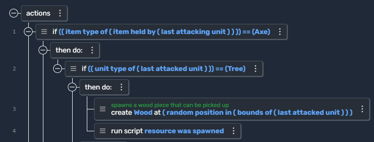
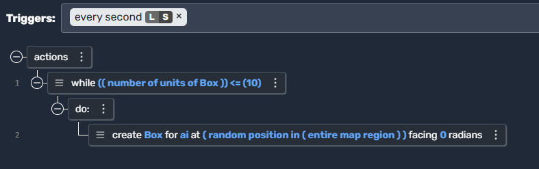
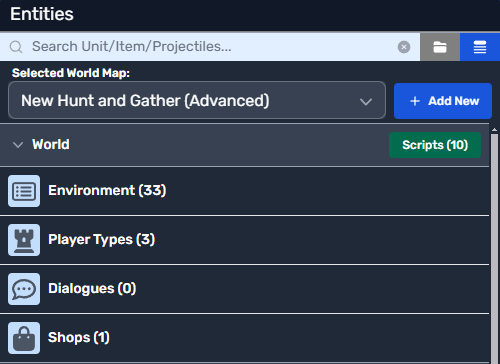

# Script Editor

## What is Visual Scripting?

Scripting allows you to **define game interactions** without writing traditional code. Instead of using programming syntax, Moddio provides a **visual interface** where you connect blocks (**actions**) to control game logic.

### How Scripts Work
## Script Components Overview

Scripting in Moddio consists of several key components:

| Component | Description |
|-----------|-------------|
| **Run On...** | Determines if the script runs **server-side** or **locally**. |
| **Triggers** | Events that activate a script (e.g., When a unit is created). |
| **Actions** | Commands executed when a trigger occurs (e.g., `Destroy entity`). |
| **Unit Scripts** | Scripts attached to **player characters, NPCs, and enemies**. |
| **Item Scripts** | Scripts affecting **weapons, potions, and collectibles**. |
| **Projectile Scripts** | Scripts controlling **bullets, arrows, or spell projectiles**. |

Scripts follow a **trigger-action** system:
- **Triggers**: Define when a script runs (e.g., "When player joins the game").
- **Actions**: Define what happens next (e.g., "Give the player a sword").
- **Sequence**: Actions execute **from top to bottom** in their script block.

Scripts can be **global** (affecting the world) or **entity-specific** (tied to units, items, or projectiles). Using entity scripts improves performance by limiting execution to relevant objects.

---

## Actions

Scripts consist of [actions](https://www.modd.io/docs/functions/) that define what happens in response to triggers. Actions range from:
- **Simple tasks**: `"Destroy this entity"`
- **Variable modifications**: `"Increase [variable] value by [number]"`
- **Conditional logic**: `"If [condition], then..."`
- **Loops**: `"Repeat while [condition] is true"`

For a full list of actions, visit the [API documentation](https://www.modd.io/docs/functions/).

---

## Triggers

Moddio uses an **event-driven system**, where [triggers](https://www.modd.io/docs/triggers/) activate scripts. Some common triggers include:
- `"Every Second"`
- `"When this entity is created"`
- `"When a unit picks up an item"`
- `"When player joins the game"`

Triggers run automatically when their conditions are met. You can also activate scripts manually using the `"Run Script"` action or by assigning keybindings.

A complete list of triggers is available in the [API documentation](https://www.modd.io/docs/triggers/).

---

## Using the Script Editor

To open the script editor:
1. Navigate to the **Entities workspace** in the Moddio editor.
2. Click the **"Scripts"** button next to a world entity, unit, item, or projectile.
3. The **Script Editor Window** opens, displaying the script list and editor panel.

  

The script editor consists of:
- **Script List (Left Panel)**: Shows all scripts and folders.
- **Script Editor (Right Panel)**: Displays the selected script, its triggers, and actions.
- **Toolbar**:
  - **Search Button**: Quickly find scripts or actions.
  - **Help Button**: Access video tutorials and documentation.
  - **JSON Toggle**: Switch between **Tree View** and **Raw JSON** for advanced editing.

---

## Creating & Managing Scripts

### Creating a New Script
1. Click **"New Script"** at the top left.
2. Right-click inside a folder and select **"Add new Script"**.

### Adding an Action
1. Click inside the script view.
2. Select an **action block** from the list.
3. Adjust parameters (e.g., entity type, values).

---

## Global vs. Entity Scripting

Entities are **objects in your game world**. Moddio features **four entity types**:
- **World** (Global scripts affecting the game state)
- **Units** (Player characters, NPCs, enemies)
- **Items** (Weapons, potions, collectables)
- **Projectiles** (Bullets, fireballs, arrows)

### Optimizing Scripts

Using **entity scripts** reduces unnecessary execution, improving performance.

Entities are **objects in your game world**. 

## 🔗 Continue Learning
- **[Triggers →](using-scripts/script-editor/triggers.md)**
- **[Actions →](using-scripts/script-editor/actions.md)**
- **[Unit Scripts →](using-scripts/script-editor/unit_scripts.md)**
- **[Item Scripts →](using-scripts/script-editor/item_scripts.md)**
- **[Projectile Scripts →](using-scripts/script-editor/projectile_scripts.md)**
- **[Run On... →](using-scripts/script-editor/run-on.md)**
