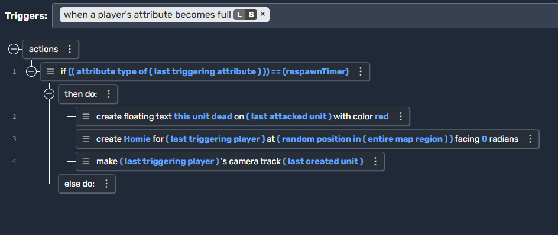
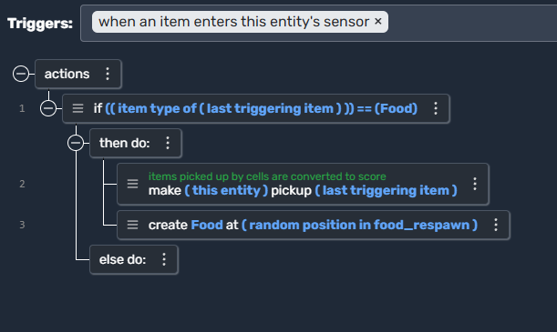

# Triggers

Triggers in **Moddio** allow you to define game logic that runs when certain conditions happen. You can think of them like **events** that fire off whenever a specific situation occurs in your game. This section explains:

1. **What a Trigger is**  
2. **How to create and configure Triggers**  
3. **How to decide which Trigger you need**  
4. **Examples of Triggers in action**

---

## What is a Trigger?

A **Trigger** is made up of two major parts:

- **Condition**: The specific event or situation that must happen before the trigger activates (e.g. “every second”, “when a unit’s attribute becomes 0 or less”, etc.).  
- **Actions**: The steps the game will take once the condition is met (e.g. “create a new unit”, “destroy the triggering unit”, “set a player attribute to 0”, etc.).

Triggers help you control the flow of your game. For example, you might want to:

- Spawn new enemies every 5 seconds.  
- Respawn a player character after its health reaches 0.  
- Reward a player with resources for destroying a particular object.  
- Track an item entering a sensor area and then pick it up.

---

## How to Use Triggers

1. **Select a Condition**: Choose the condition under which the trigger should run. For instance, “every second” will run the trigger continuously each second.  
2. **Configure Conditions**: Some triggers have additional parameters. For example, “when a unit’s attribute becomes 0 or less” could be specifically looking at health or any other attribute you define.  
3. **Add Actions**: Within the trigger, add one or more actions. Actions can include creating items, spawning units, showing text, updating attributes, or anything else supported by **Moddio**.  
4. **Test & Iterate**: After setting up your trigger, test it in-game. Adjust conditions and actions as necessary.

---

## Picking the Right Trigger

Choosing which trigger to use depends on the **event** that you want to detect:

- **Time-based Events**  
  - Example: “every second” or “every X seconds”  
  - Use this when you need periodic actions like spawning a set of units over time.
  
- **Unit-based Events**  
  - Example: “when a unit’s attribute becomes 0 or less”  
  - Use this when you need to react to a unit dying or an attribute depleting (e.g., health, energy).
  
- **Player-based Events**  
  - Example: “when a player’s attribute becomes full”  
  - Use this when you need to respond to changes in a player-specific attribute (e.g., a timer reaching full).
  
- **Item-based Events**  
  - Example: “when an item enters this entity’s sensor”  
  - Use this when you need to detect items entering or leaving an area to trigger an action (e.g., picking up items automatically).
  
By understanding the type of event you want to respond to, you can narrow down which condition belongs in your trigger.

---

## Examples

Below are some sample triggers showing how to achieve specific behaviors. All examples are illustrated in Moddio’s user interface, but they also map conceptually to a simple “if condition -> do actions” system.

---

## 1. Basic Item Collection

**Trigger:** **When an item enters this entity’s sensor**

  

### Explanation
**Trigger**: `every second`  
**Action**:  
- Check if the number of **Box** units is less than or equal to 10.  
- If so, create a Box at a random position in the map.

This trigger activates whenever an **item enters the sensor area** of an entity. It checks if the item is of type **Food**, and if so:

**Use case:** Food collection, item gathering, or power-up pickups.

---

## 2. Periodic Spawning

**Trigger:** **Every second**

  

### Explanation
**Trigger**: `when a unit's attribute becomes 0 or less`  
**Action**:  
- Check if the attribute that hit 0 is health.
- Then, determine the unit type (Homie, Pig, Tree, etc.) and run the appropriate response:

1. **Homie:**  
   - Sets the **respawnTimer** for the owner’s player to **0**.  
   - Makes the unit **drop all its items**.

2. **Pig:**  
   - Spawns **Meat** at the pig’s position.

3. **Tree:**  
   - Gives **Wood** to the player who last attacked it.

4. Finally, the unit is **destroyed**.

**Use case:** Automatic enemy spawning, resource regeneration, or timed mechanics.

---

## 3. Player Respawning

**Trigger:** **When a player's attribute becomes full**

  

### Explanation
**Trigger**: `when a player's attribute becomes full`  
**Action**:  
- Check if the attribute that became full is `respawnTimer`
- Create a floating text message, spawn a Homie again for that player, and make the camera track it.

**Use case:** Player respawning, revival mechanics, or post-death effects.

---

## 4. Unit Death and Resource Drops

**Trigger:** **When a unit’s attribute becomes 0 or less**

  

### Explanation
**Trigger**: `when an item enters this entity's sensor`  
**Action**:  
- If the item is of type Food, make the entity pick it up, and then create new Food in a food_respawn region.

**Use case:** Combat mechanics, loot drops, and resource gathering.

---

## Summary

| Example                   | Trigger                                    | Purpose                                                 |
|---------------------------|--------------------------------------------|---------------------------------------------------------|
| **Item Collection**       | When an item enters sensor                 | Pickup and respawn items                                |
| **Periodic Spawning**     | Every second                               | Auto-generate entities (enemies, resources, etc.)       |
| **Player Respawning**     | When a player's attribute becomes full     | Handle player deaths, respawns, or revival mechanics    |
| **Unit Death & Resources**| When a unit’s health reaches 0 (or less)   | Loot drops, resource gathering, and destroying units    |

Triggers are the foundation of **game interactions** in Moddio. By combining different triggers, developers can create **complex mechanics** such as combat systems, resource gathering, or automated game functions.

---

## 🔗 Continue Learning
- **[Actions →](using-scripts/script-editor/actions.md)**
- **[Unit Scripts →](using-scripts/script-editor/unit_scripts.md)**
- **[Item Scripts →](using-scripts/script-editor/item_scripts.md)**
- **[Projectile Scripts →](using-scripts/script-editor/projectile_scripts.md)**
- **[Run On... →](using-scripts/script-editor/run-on.md)**
