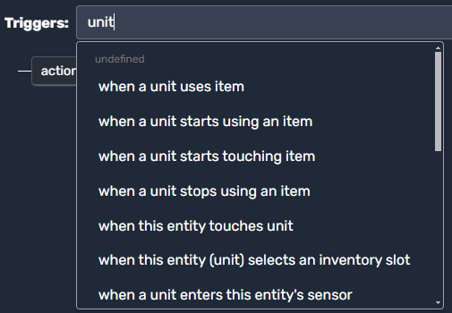
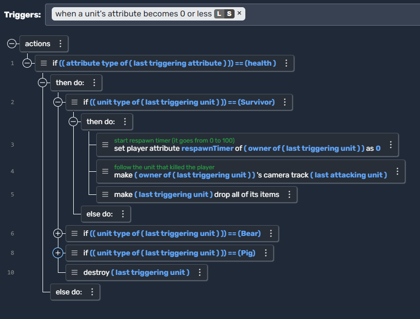

# Unit Scripts

In Moddio, you can create scripts that run **specifically on Units**, allowing you to customize their behavior. This includes responding to triggers such as *touching*, *using items*, *moving*, or *losing health*. Below, we’ll explore:

1. **Where to attach Unit scripts**  
2. **Common triggers** you can use  
3. **Examples** of practical scripting scenarios

---

## Attaching a Script to a Unit

There are two main ways to use scripts on Units:

1. **Unit Script (via Editor)**  
   - In the **Game Editor**, select or create a new Unit type.  
   - Navigate to **Scripts** (or a similarly labeled tab), where you’ll see a list of triggers to add logic.  
2. **Global Scripts that affect Units**  
   - Alternatively, you can use a *global script* with a trigger that specifically references Units (e.g., “when a unit starts touching item”).  
   - Great for cross-Unit interaction logic or if your code affects **all** Units equally.

Either approach allows you to set up triggers and actions tied to Unit behaviors.

---

## Triggers for Unit Scripts

When creating or editing a script, you’ll see a **“Triggers”** dropdown where you can filter for “Unit” to find relevant events:

  

> *Example:* Searching “unit” in the trigger field displays options like “when a unit uses item,” “when a unit starts using an item,” “when this entity touches unit,” etc.

## Common Unit Triggers & Use Cases

Below is a list of triggers you’ll likely see when searching for `unit`. Each includes a short example of how or why you might use it.

1. **when a unit uses item**  
   - **Use Case**: A player uses a potion or weapon. You might apply healing effect, trigger a spell effect, or consume ammo in response.

2. **when a unit starts using an item**  
   - **Use Case**: A longer “use” animation or channeling effect (e.g., charging a bow). You can begin the animation or lock movement.

3. **when a unit stops using an item**  
   - **Use Case**: Conclude the effect—e.g., release an arrow, finish drinking a potion, or interrupt the usage if canceled.

4. **when a unit starts touching item**  
   - **Use Case**: A unit walks into a coin or pickup. You can automatically add it to inventory or display a prompt to pick it up.

5. **when a unit stops touching item**  
   - **Use Case**: Often used for temporary interactions. For instance, if a unit leaves a healing zone or moves away from a resource node.

6. **when this entity touches unit**  
   - **Use Case**: Reverse perspective—if you’re scripting from the item’s side, you can detect collisions with units (e.g., damage if it’s a spike trap).

7. **when this entity (unit) selects an inventory slot**  
   - **Use Case**: Monitor which item a player is switching to. For example, updating UI to reflect “Slot #2 = Sword.”

8. **when a unit enters this entity’s sensor**  
   - **Use Case**: For AI turrets, traps, or security cameras. Detect if a Unit enters a radius (the “sensor”), then fire an alarm or attack script.

### Example: When a Unit’s Attribute Reaches 0

This is a common pattern for implementing a Unit’s “death” event when health hits 0:

> *Usage:*  
> - Often used for health bars or custom attributes like “stamina.”  
> - Great for spawning new items, playing a death animation, or tracking kills.

---

## Sample Script Snippet

  

This script runs whenever a **Unit’s attribute** drops to **0 or less**—for example, when a Unit’s *health* hits 0. Here’s how it works in simple terms:

1. **Trigger Condition**  
   - The trigger fires when the Unit’s health (or another specified attribute) becomes zero or negative.

2. **Attribute Check**  
   - The script confirms that the attribute in question is indeed “health.” If it’s something else (like stamina), the script can either ignore it or handle it differently.

3. **Unit Type Detection**  
   - Next, the script identifies what kind of Unit has died (for example, a “Survivor” player character, a “Bear,” or a “Pig”).

4. **Player (Survivor) Logic**  
   - If the Unit is a “Survivor,” the script starts the **respawn process**—setting the player’s respawn timer to 0 and optionally switching the camera to follow the last attacker, so the player sees who defeated them.  
   - It also makes the unit **drop all items** they were carrying before dying.

5. **Other Unit Types (Bear/Pig/Etc.)**  
   - If the Unit is a Bear or Pig, the script **destroys** it when its health reaches 0.  
   - Additionally we can add other actions in the case of a Bear or Pig dying.

## 🔗 Continue Learning
- **[Triggers →](using-scripts/script-editor/triggers.md)**
- **[Actions →](using-scripts/script-editor/actions.md)**
- **[Item Scripts →](using-scripts/script-editor/item_scripts.md)**
- **[Projectile Scripts →](using-scripts/script-editor/projectile_scripts.md)**
- **[Run On... →](using-scripts/script-editor/run-on.md)**
