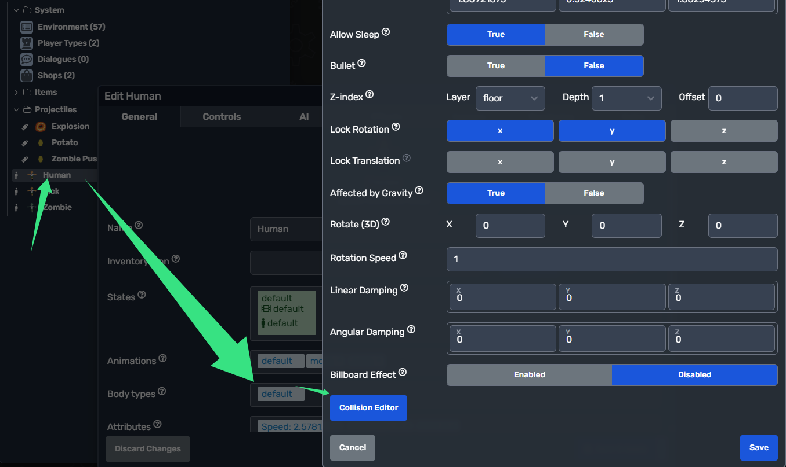
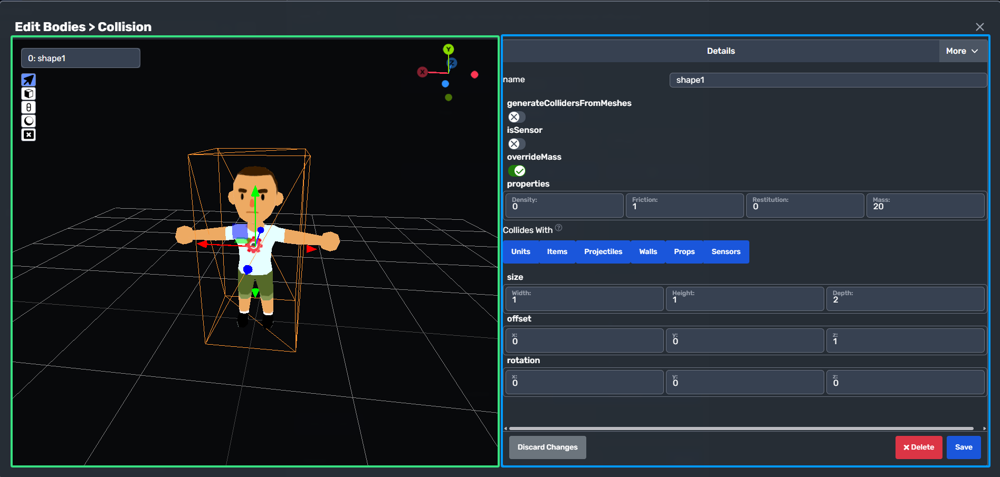
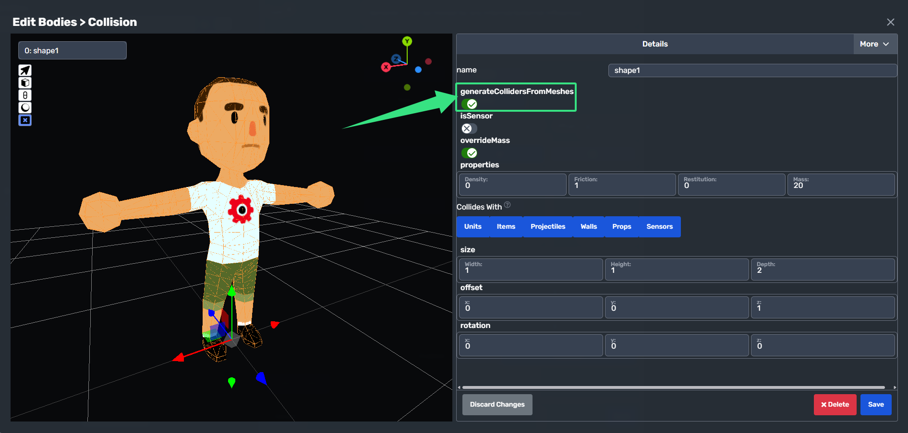

WARNING: This feature is in beta and contains a few bugs. Use with caution.

<table style="display: flex;justify-content: center;" id="moddioVersion">
<thead>
    <tr>
        <th>Moddio Version: 3.0.6.23</th>
        <th>(current)</th>
    </tr>
</thead>
<tbody></tbody>
</table>
    

> 🚧 Beware!  is heavily under construction and a lot of things may change.
> Please use the latest version whenever possible

In this guide, we'll walk you through the basics of using the collision editor, including its main function features.

## **Where Is Collision Editor?**
open the body setting of any entity type, then find the collision editor button at the bottom of the modal

  

## **Interface Overview**

  

The editor interface includes these key components (visual layout reference):
- **Canvas (Left)**: Your main workspace for designing the colliders.
- **Details (Right)**: Edit settings for selected colliders.

---

## **Core Tools & Shortcuts**
### **Editing Tools**
| Tool | Shortcut | Function |
|------|----------|----------|
| **Cursor** | `C` | Select/move colliders.  `Q/W/E to switch mode to translation/Rotate/Scale`  |
| **Cube Shape** | `A` | click LMB to create collider with cube shape. |
| **Capsule Shape** | `D` | click LMB to create collider with capsule shape. |
| **Ball Shape** | `B` | click LMB to create collider with ball shape. |
| **Delete Collider** | `Delete` | Delete selected collider. |

---

## **Advanced Features**
### **Generate Collider From Mesh**

  

---

**Need More Help?** Visit Modd.io’s official forums or Discord community for advanced tips and support.