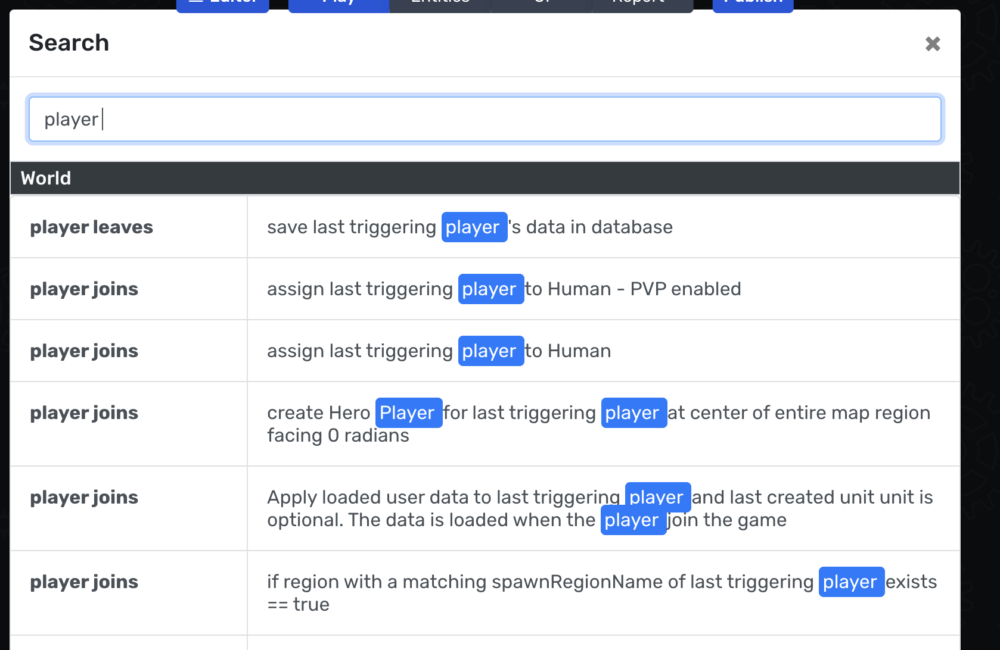
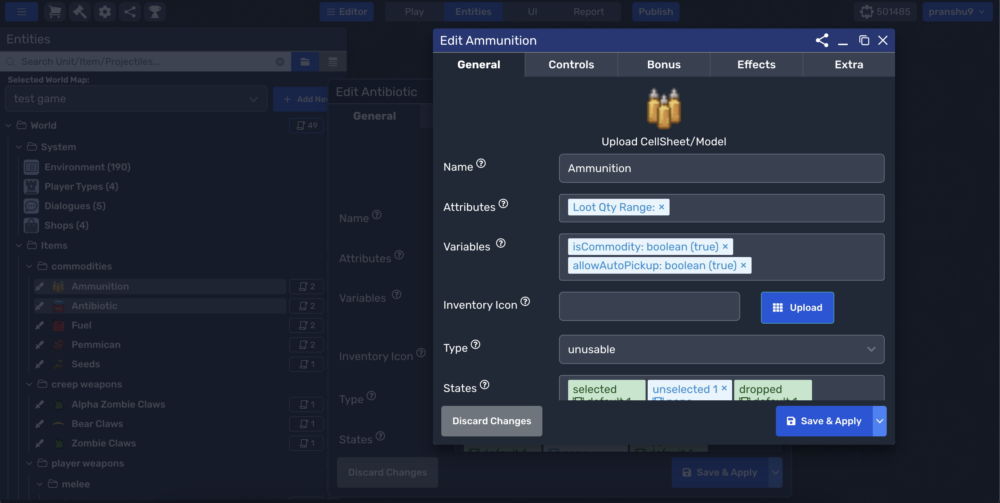
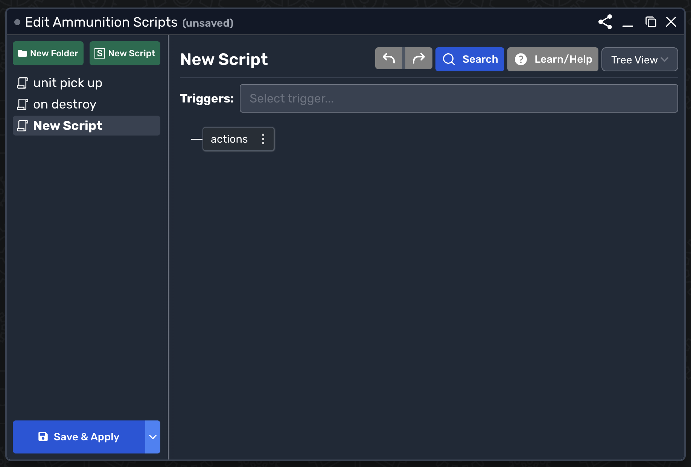
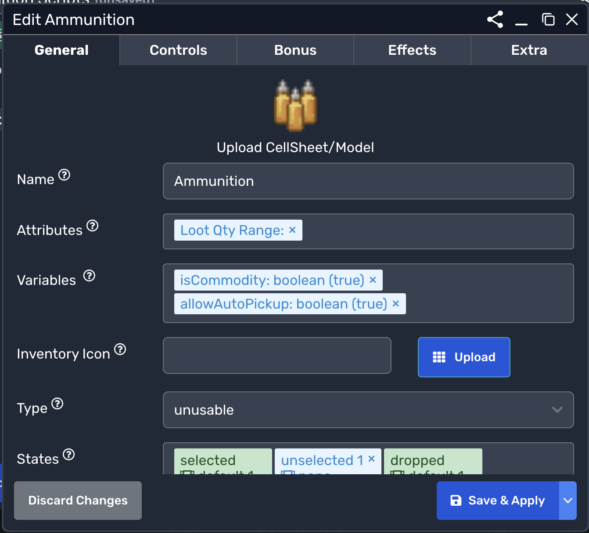
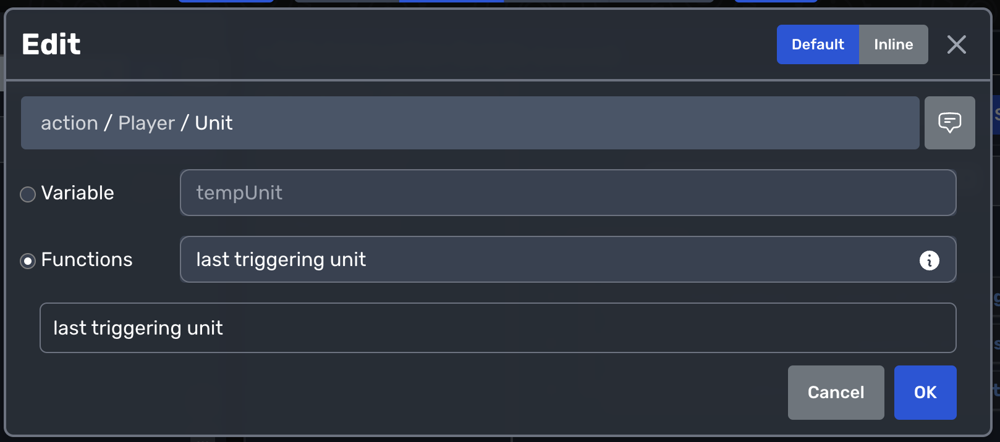

# Game Editor Shortcuts

## Editor Tab Switching

- **Play**: `Alt+1` (Windows) | `Option+1` (MacOS)
- **Map**: `Alt+2` (Windows) | `Option+2` (MacOS)
- **Entities**: `Alt+3` (Windows) | `Option+3` (MacOS)
- **UI**: `Alt+4` (Windows) | `Option+4` (MacOS)
- **Report**: `Alt+5` (Windows) | `Option+5` (MacOS)
- **Publish**: `Alt+P` (Windows) | `Option+P` (MacOS)

## Global Script Search

- **Search Scripts**: `Ctrl+F` (Windows) | `Control+F` (MacOS)

## Window Navigation

- **Switch Windows**: `` Alt+` `` (Windows) | `` Option+\` `` (MacOS)
- **Reverse Switch**: `` Alt+Shift+` `` (Windows) | `` Option+Shift+\` `` (MacOS)
- **Alternate Switch**: `Alt+W` (Windows) | `Option+W` (MacOS)
- **Reverse Alternate Switch**: `Alt+Shift+W` (Windows) | `Option+Shift+W` (MacOS)

## Script Window Management

- **Save Scripts**: `Ctrl+S` (Windows) | `Control+S` (MacOS)
- **Save and Close Scripts**: `Ctrl+Shift+S` (Windows) | `Control+Shift+S` (MacOS)
- **Close Scripts**: `Esc`

## Entity Properties Management

- **Save and Close Entity Properties**: `Ctrl+S` (Windows) | `Control+S` (MacOS)
- **Close Entity Properties**: `Esc` (MacOS & Windows)

## Action Editor Modal

- **Save Change**: `Enter` (MacOS & Windows)
- **Reject Change**: `Esc` (MacOS & Windows)

## Miscellaneous Modals
- **Save and Close Various Modals**: `Enter` (MacOS & Windows)
- **Close Without Saving**: `Esc` (MacOS & Windows)