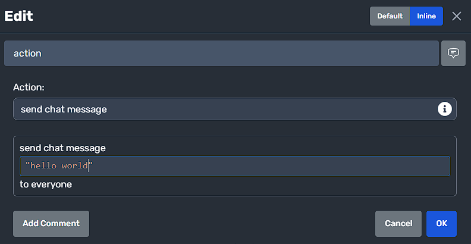

WARNING: This feature is in beta and contains a few bugs. Use with caution


<table style="display: flex;justify-content: center;" id="moddioVersion">
<thead>
    <tr>
        <th>Moddio Version: 2.0.11</th>
        <th>(current)</th>
    </tr>
</thead>
<tbody></tbody>
</table>
    

> 🚧 Beware! inline-editing is heavily under construction and a lot of things may change.
> Please use the latest version whenever possible


If you're tired of clicking on each slot in the script editor, there's a solution for you: inline editing. You can change the editing mode in the script modal or use the shortcut <code>**ctrl+q**</code> to toggle the editing mode. This feature allows you to edit multiple slots simultaneously without having to navigate through nested objects. It's especially useful for editing numbers. You can freely copy and paste in the inline editing mode.

[inline-editing](../img/inline-editing/introduce.png)

  
As you can see, the nested script action is getting 'flattened' into a single code string. This allows you to edit the complete script action at once without the need to navigate deep into the nested object. It also enables copying ang pasting snippets of code freely.

---

## "Hello World" Example
To start with a classic "hello world" example, you can choose the <code>send chat message</code> action from the dropdown menu in the script editor. Switch to inline editing mode and type "hello world" within quotes. You can also use single quotes if you need to include double quotes within the string. For example, 'once upon a time, someone said: "hello world"'.

  

Inline editing is particularly useful when concatenating strings with other strings or numbers. For instance, you can try typing the following code:  

> Try typing

```js
"a random number = " + randNumber(0, 5);
```

> Tips  
 Inline-editing will automatically handle <code>string</code> + <code>number</code> if the addition equation contains the <code>string</code>, the output will be <code>string</code>, and <code>number</code> + <code>number</code> will be concat as <code>string</code>

```js
1 + 1 + "hello" // "11hello"
(1 + 1) + "hello"; // "2hello"
```

## Action aliases
> In inline-editing, we have many action aliases to simplify function calling, here is the table  
Don't worry! The autocomplete suggestions will help you, so there's no need to remember these aliases.

| Function Name | Alias |
| --- | --- |
| getRandomNumberBetween | randNumber |
| xyCoordinate | pos |
| dynamicRegion | region |
| mathFloor | floor |
| squareRoot | sqrt |
| getRandomItemTypeFromItemTypeGroup | randItemType |
| stringToNumber | str2num |
| getPositionY | y |
| getPositionX | x |
| getXCoordinateOfRegion | x |
| getYCoordinateOfRegion | y |
| getItemTypeOfItem | type |
| getUnitTypeOfUnit | type |
| playerTypeOfPlayer | type |
| getRandomUnitTypeFromUnitTypeGroup | type |
| undefinedValue | undefined |
| getRandomPositionInRegion | randPos |
| substringOf | slice |
| absoluteValueOfNumber | abs |
| getExponent | pow |
| numberToString | num2str |
| stringToObject | str2obj |
| objectToString | obj2Str |
| unitsFacingAngle | facingAngle |
| getCurrentAmmoOfItem | currentAmmo |
| changeDescriptionOfItem | changeDesc |
| getOwnerOfItem | owner |
| setFadingTextOfUnit | setFadingText |
| getSensorOfUnit | sensor |
| getPositionInFrontOfPosition | polarProjection |
| lastPlayedTimeOfPlayer | lastPlayedTime |
| getLastPurchasedUnit | lastPurchasedUnit |
| getLastPlayerSelectingDialogueOption | lastSelectingDialogueOption |
| getTriggeringItem | triggeringItem |
| playerCustomInput | lastPlayerInput |
| getTriggeringRegion | triggeringRegion |
| getLastOverlappingUnit | lastOverlappingUnit |
| lastPurchasedUnitTypetId | lastPurchasedUnitType |
| getTriggeringPlayer | triggeringPlayer |
| getLastOverlappedUnit | lastOverlappedUnit |
| getLastCreatedItem | lastCreatedItem |
| getLastCreatedProjectile | lastCreatedProjectile |
| getLastTouchingUnit | lastTouchingUnit |
| getLastOverlappingItem | lastOverlappingItem |
| entityLastRaycastCollisionPosition | lastRaycastCollisionPos |
| getLastCastingUnit | lastCastingUnit |
| getLastTouchedUnit | lastTouchedUnit |
| getTriggeringProjectile | triggeringProj |
| getLastCreatedUnit | lastCreatedUnit |
| getTriggeringUnit | triggeringUnit |
| getLastTouchedItem | lastTouchedItem |
| getLastTouchedProjectile | lastTouchedProj |
| getLastOverlappingProjectile | lastOverlappingProj |
| getTriggeringAttribute | triggeringAttr |
| getLastAttackedUnit | lastAttackedUnit |
| getLastAttackingUnit | lastAttackingUnit |
| getLastChatMessageSentByPlayer | lastChatMessageSent |
| getLastAttackingItem | lastAttackingItem |

You can use these aliases directly. For example, `pos(2, 5)` creates a position [2|5] just like `xyCoordinate(2, 5)` does.

## Method & Property
> Do you know about method chaining?  
> It's something that allows you to call the functions one by one like in a chain by connectiong the function calls with dots like:
```js
pos(5, 6).x.abs // equals to abs(getXCoordinate(xyCoordinate(5, 6))), seems much better, right?
```
Method chaining can help shorten long, nested chains of function calls.

Yes, the inline-editing can help you do this thing, you only need to connect them one by one.
Some properties have the same names with functions that differ based on context: 
```js
// inline-editing can handle different data type with the same name
// you don't need to use 'getPositionX' for pos, 'getXCoordinateOfRegion' for region
pos(1,1).x // 1
region(2,2,1,1).x // 2
```

here is the table of contents currently available

|x|y|type|
|---|---|---|
|region|region|item|
|pos|pos|unit|
|-|-|player|
|-|-|unitTypeGroup|

## Attributes & Variables
Use <code>someEntity.some_var</code> to get the entity variable. An autocomplete dropdown will open once you type the `.` that lists all available variables of the entity.   
Similarly, <code>someEntity.$some_attr</code> accesses the entered attribute of the entity. Once you type `.$` after an entity, autosuggest will provide you with possible attribute selections.

```js
// you need to define these attr or var first in entity editor
thisEntity.deathCount
thisEntity.$health
```
Remember: `entity.` to list **variables**, `entity.$` to list **attributes**.

## If statement

In inline editing, you can use various operators for conditional statements. Here are a few examples:

- **&&** (and): `pos(0, 1).y > 1 && thisEntity.$health != 10` resolves true if both conditions are true
- **||** (or): `pos(0, 1).y > 1 || thisEntity.$health == 10` resolves to true if either condition is true
- **!=** (not equal): `1 != 2` resolves true if the parameters do not match
- **==** (equal): `1 == 1` resolves true if the parameters match
- **>, <, >=, <=** (bigger than, smaller than, bigger or equal to, smaller or equal to): pos(0, 1).y > 1 && thisEntity.$health <= 10

## Colors

There are some built-in colors

|NAME|Hex|Preview|
|---|---|---|
|aliceblue|#f0f8ff|<div class="color-preview" style="height: 20px;background: #f0f8ff;"></div>|
|antiquewhite|#faebd7|<div class="color-preview" style="height: 20px;background: #faebd7;"></div>|
|aqua|#00ffff|<div class="color-preview" style="height: 20px;background: #00ffff;"></div>|
|aquamarine|#7fffd4|<div class="color-preview" style="height: 20px;background: #7fffd4;"></div>|
|azure|#f0ffff|<div class="color-preview" style="height: 20px;background: #f0ffff;"></div>|
|beige|#f5f5dc|<div class="color-preview" style="height: 20px;background: #f5f5dc;"></div>|
|bisque|#ffe4c4|<div class="color-preview" style="height: 20px;background: #ffe4c4;"></div>|
|black|#000000|<div class="color-preview" style="height: 20px;background: #000000;"></div>|
|blanchedalmond|#ffebcd|<div class="color-preview" style="height: 20px;background: #ffebcd;"></div>|
|blue|#0000ff|<div class="color-preview" style="height: 20px;background: #0000ff;"></div>|
|blueviolet|#8a2be2|<div class="color-preview" style="height: 20px;background: #8a2be2;"></div>|
|brown|#a52a2a|<div class="color-preview" style="height: 20px;background: #a52a2a;"></div>|
|burlywood|#deb887|<div class="color-preview" style="height: 20px;background: #deb887;"></div>|
|cadetblue|#5f9ea0|<div class="color-preview" style="height: 20px;background: #5f9ea0;"></div>|
|chartreuse|#7fff00|<div class="color-preview" style="height: 20px;background: #7fff00;"></div>|
|chocolate|#d2691e|<div class="color-preview" style="height: 20px;background: #d2691e;"></div>|
|coral|#ff7f50|<div class="color-preview" style="height: 20px;background: #ff7f50;"></div>|
|cornflowerblue|#6495ed|<div class="color-preview" style="height: 20px;background: #6495ed;"></div>|
|cornsilk|#fff8dc|<div class="color-preview" style="height: 20px;background: #fff8dc;"></div>|
|crimson|#dc143c|<div class="color-preview" style="height: 20px;background: #dc143c;"></div>|
|cyan|#00ffff|<div class="color-preview" style="height: 20px;background: #00ffff;"></div>|
|darkblue|#00008b|<div class="color-preview" style="height: 20px;background: #00008b;"></div>|
|darkcyan|#008b8b|<div class="color-preview" style="height: 20px;background: #008b8b;"></div>|
|darkgoldenrod|#b8860b|<div class="color-preview" style="height: 20px;background: #b8860b;"></div>|
|darkgray|#a9a9a9|<div class="color-preview" style="height: 20px;background: #a9a9a9;"></div>|
|darkgreen|#006400|<div class="color-preview" style="height: 20px;background: #006400;"></div>|
|darkgrey|#a9a9a9|<div class="color-preview" style="height: 20px;background: #a9a9a9;"></div>|
|darkkhaki|#bdb76b|<div class="color-preview" style="height: 20px;background: #bdb76b;"></div>|
|darkmagenta|#8b008b|<div class="color-preview" style="height: 20px;background: #8b008b;"></div>|
|darkolivegreen|#556b2f|<div class="color-preview" style="height: 20px;background: #556b2f;"></div>|
|darkorange|#ff8c00|<div class="color-preview" style="height: 20px;background: #ff8c00;"></div>|
|darkorchid|#9932cc|<div class="color-preview" style="height: 20px;background: #9932cc;"></div>|
|darkred|#8b0000|<div class="color-preview" style="height: 20px;background: #8b0000;"></div>|
|darksalmon|#e9967a|<div class="color-preview" style="height: 20px;background: #e9967a;"></div>|
|darkseagreen|#8fbc8f|<div class="color-preview" style="height: 20px;background: #8fbc8f;"></div>|
|darkslateblue|#483d8b|<div class="color-preview" style="height: 20px;background: #483d8b;"></div>|
|darkslategray|#2f4f4f|<div class="color-preview" style="height: 20px;background: #2f4f4f;"></div>|
|darkturquoise|#00ced1|<div class="color-preview" style="height: 20px;background: #00ced1;"></div>|
|darkviolet|#9400d3|<div class="color-preview" style="height: 20px;background: #9400d3;"></div>|
|deeppink|#ff1493|<div class="color-preview" style="height: 20px;background: #ff1493;"></div>|
|deepskyblue|#00bfff|<div class="color-preview" style="height: 20px;background: #00bfff;"></div>|
|dimgray|#696969|<div class="color-preview" style="height: 20px;background: #696969;"></div>|
|dodgerblue|#1e90ff|<div class="color-preview" style="height: 20px;background: #1e90ff;"></div>|
|firebrick|#b22222|<div class="color-preview" style="height: 20px;background: #b22222;"></div>|
|floralwhite|#fffaf0|<div class="color-preview" style="height: 20px;background: #fffaf0;"></div>|
|forestgreen|#228b22|<div class="color-preview" style="height: 20px;background: #228b22;"></div>|
|fuchsia|#ff00ff|<div class="color-preview" style="height: 20px;background: #ff00ff;"></div>|
|gainsboro|#dcdcdc|<div class="color-preview" style="height: 20px;background: #dcdcdc;"></div>|
|ghostwhite|#f8f8ff|<div class="color-preview" style="height: 20px;background: #f8f8ff;"></div>|
|gold|#ffd700|<div class="color-preview" style="height: 20px;background: #ffd700;"></div>|
|goldenrod|#daa520|<div class="color-preview" style="height: 20px;background: #daa520;"></div>|
|gray|#808080|<div class="color-preview" style="height: 20px;background: #808080;"></div>|
|green|#008000|<div class="color-preview" style="height: 20px;background: #008000;"></div>|
|greenyellow|#adff2f|<div class="color-preview" style="height: 20px;background: #adff2f;"></div>|
|grey|#808080|<div class="color-preview" style="height: 20px;background: #808080;"></div>|
|honeydew|#f0fff0|<div class="color-preview" style="height: 20px;background: #f0fff0;"></div>|
|hotpink|#ff69b4|<div class="color-preview" style="height: 20px;background: #ff69b4;"></div>|
|indianred|#cd5c5c|<div class="color-preview" style="height: 20px;background: #cd5c5c;"></div>|
|indigo|#4b0082|<div class="color-preview" style="height: 20px;background: #4b0082;"></div>|
|ivory|#fffff0|<div class="color-preview" style="height: 20px;background: #fffff0;"></div>|
|khaki|#f0e68c|<div class="color-preview" style="height: 20px;background: #f0e68c;"></div>|
|lavender|#e6e6fa|<div class="color-preview" style="height: 20px;background: #e6e6fa;"></div>|
|lavenderblush|#fff0f5|<div class="color-preview" style="height: 20px;background: #fff0f5;"></div>|
|lawngreen|#7cfc00|<div class="color-preview" style="height: 20px;background: #7cfc00;"></div>|
|lemonchiffon|#fffacd|<div class="color-preview" style="height: 20px;background: #fffacd;"></div>|
|lightblue|#add8e6|<div class="color-preview" style="height: 20px;background: #add8e6;"></div>|
|lightcoral|#f08080|<div class="color-preview" style="height: 20px;background: #f08080;"></div>|
|lightcyan|#e0ffff|<div class="color-preview" style="height: 20px;background: #e0ffff;"></div>|
|lightgoldenrodyellow|#fafad2|<div class="color-preview" style="height: 20px;background: #fafad2;"></div>|
|lightgray|#d3d3d3|<div class="color-preview" style="height: 20px;background: #d3d3d3;"></div>|
|lightgreen|#90ee90|<div class="color-preview" style="height: 20px;background: #90ee90;"></div>|
|lightgrey|#d3d3d3|<div class="color-preview" style="height: 20px;background: #d3d3d3;"></div>|
|lightpink|#ffb6c1|<div class="color-preview" style="height: 20px;background: #ffb6c1;"></div>|
|lightsalmon|#ffa07a|<div class="color-preview" style="height: 20px;background: #ffa07a;"></div>|
|lightseagreen|#20b2aa|<div class="color-preview" style="height: 20px;background: #20b2aa;"></div>|
|lightskyblue|#87cefa|<div class="color-preview" style="height: 20px;background: #87cefa;"></div>|
|lightslategray|#778899|<div class="color-preview" style="height: 20px;background: #778899;"></div>|
|lightsteelblue|#b0c4de|<div class="color-preview" style="height: 20px;background: #b0c4de;"></div>|
|lightyellow|#ffffe0|<div class="color-preview" style="height: 20px;background: #ffffe0;"></div>|
|lime|#00ff00|<div class="color-preview" style="height: 20px;background: #00ff00;"></div>|
|limegreen|#32cd32|<div class="color-preview" style="height: 20px;background: #32cd32;"></div>|
|linen|#faf0e6|<div class="color-preview" style="height: 20px;background: #faf0e6;"></div>|
|magenta|#ff00ff|<div class="color-preview" style="height: 20px;background: #ff00ff;"></div>|
|maroon|#800000|<div class="color-preview" style="height: 20px;background: #800000;"></div>|
|mediumaquamarine|#66cdaa|<div class="color-preview" style="height: 20px;background: #66cdaa;"></div>|
|mediumblue|#0000cd|<div class="color-preview" style="height: 20px;background: #0000cd;"></div>|
|mediumorchid|#ba55d3|<div class="color-preview" style="height: 20px;background: #ba55d3;"></div>|
|mediumpurple|#9370db|<div class="color-preview" style="height: 20px;background: #9370db;"></div>|
|mediumseagreen|#3cb371|<div class="color-preview" style="height: 20px;background: #3cb371;"></div>|
|mediumslateblue|#7b68ee|<div class="color-preview" style="height: 20px;background: #7b68ee;"></div>|
|mediumspringgreen|#00fa9a|<div class="color-preview" style="height: 20px;background: #00fa9a;"></div>|
|mediumturquoise|#48d1cc|<div class="color-preview" style="height: 20px;background: #48d1cc;"></div>|
|mediumvioletred|#c71585|<div class="color-preview" style="height: 20px;background: #c71585;"></div>|
|midnightblue|#191970|<div class="color-preview" style="height: 20px;background: #191970;"></div>|
|mintcream|#f5fffa|<div class="color-preview" style="height: 20px;background: #f5fffa;"></div>|
|mistyrose|#ffe4e1|<div class="color-preview" style="height: 20px;background: #ffe4e1;"></div>|
|moccasin|#ffe4b5|<div class="color-preview" style="height: 20px;background: #ffe4b5;"></div>|
|navajowhite|#ffdead|<div class="color-preview" style="height: 20px;background: #ffdead;"></div>|
|navy|#000080|<div class="color-preview" style="height: 20px;background: #000080;"></div>|
|oldlace|#fdf5e6|<div class="color-preview" style="height: 20px;background: #fdf5e6;"></div>|
|olive|#808000|<div class="color-preview" style="height: 20px;background: #808000;"></div>|
|olivedrab|#6b8e23|<div class="color-preview" style="height: 20px;background: #6b8e23;"></div>|
|orange|#ffa500|<div class="color-preview" style="height: 20px;background: #ffa500;"></div>|
|orangered|#ff4500|<div class="color-preview" style="height: 20px;background: #ff4500;"></div>|
|orchid|#da70d6|<div class="color-preview" style="height: 20px;background: #da70d6;"></div>|
|palegoldenrod|#eee8aa|<div class="color-preview" style="height: 20px;background: #eee8aa;"></div>|
|palegreen|#98fb98|<div class="color-preview" style="height: 20px;background: #98fb98;"></div>|
|paleturquoise|#afeeee|<div class="color-preview" style="height: 20px;background: #afeeee;"></div>|
|palevioletred|#db7093|<div class="color-preview" style="height: 20px;background: #db7093;"></div>|
|papayawhip|#ffefd5|<div class="color-preview" style="height: 20px;background: #ffefd5;"></div>|
|peachpuff|#ffdab9|<div class="color-preview" style="height: 20px;background: #ffdab9;"></div>|
|peru|#cd853f|<div class="color-preview" style="height: 20px;background: #cd853f;"></div>|
|pink|#ffc0cb|<div class="color-preview" style="height: 20px;background: #ffc0cb;"></div>|
|plum|#dda0dd|<div class="color-preview" style="height: 20px;background: #dda0dd;"></div>|
|powderblue|#b0e0e6|<div class="color-preview" style="height: 20px;background: #b0e0e6;"></div>|
|purple|#800080|<div class="color-preview" style="height: 20px;background: #800080;"></div>|
|red|#ff0000|<div class="color-preview" style="height: 20px;background: #ff0000;"></div>|
|rosybrown|#bc8f8f|<div class="color-preview" style="height: 20px;background: #bc8f8f;"></div>|
|royalblue|#4169e1|<div class="color-preview" style="height: 20px;background: #4169e1;"></div>|
|saddlebrown|#8b4513|<div class="color-preview" style="height: 20px;background: #8b4513;"></div>|
|salmon|#fa8072|<div class="color-preview" style="height: 20px;background: #fa8072;"></div>|
|sandybrown|#f4a460|<div class="color-preview" style="height: 20px;background: #f4a460;"></div>|
|seagreen|#2e8b57|<div class="color-preview" style="height: 20px;background: #2e8b57;"></div>|
|seashell|#fff5ee|<div class="color-preview" style="height: 20px;background: #fff5ee;"></div>|
|sienna|#a0522d|<div class="color-preview" style="height: 20px;background: #a0522d;"></div>|
|silver|#c0c0c0|<div class="color-preview" style="height: 20px;background: #c0c0c0;"></div>|
|skyblue|#87ceeb|<div class="color-preview" style="height: 20px;background: #87ceeb;"></div>|
|slateblue|#6a5acd|<div class="color-preview" style="height: 20px;background: #6a5acd;"></div>|
|slategray|#708090|<div class="color-preview" style="height: 20px;background: #708090;"></div>|
|snow|#fffafa|<div class="color-preview" style="height: 20px;background: #fffafa;"></div>|
|springgreen|#00ff7f|<div class="color-preview" style="height: 20px;background: #00ff7f;"></div>|
|steelblue|#4682b4|<div class="color-preview" style="height: 20px;background: #4682b4;"></div>|
|tan|#d2b48c|<div class="color-preview" style="height: 20px;background: #d2b48c;"></div>|
|teal|#008080|<div class="color-preview" style="height: 20px;background: #008080;"></div>|
|thistle|#d8bfd8|<div class="color-preview" style="height: 20px;background: #d8bfd8;"></div>|
|tomato|#ff6347|<div class="color-preview" style="height: 20px;background: #ff6347;"></div>|
|turquoise|#40e0d0|<div class="color-preview" style="height: 20px;background: #40e0d0;"></div>|
|violet|#ee82ee|<div class="color-preview" style="height: 20px;background: #ee82ee;"></div>|
|wheat|#f5deb3|<div class="color-preview" style="height: 20px;background: #f5deb3;"></div>|
|white|#ffffff|<div class="color-preview" style="height: 20px;background: #ffffff;"></div>|
|whitesmoke|#f5f5f5|<div class="color-preview" style="height: 20px;background: #f5f5f5;"></div>|
|yellow|#ffff00|<div class="color-preview" style="height: 20px;background: #ffff00;"></div>|
|yellowgreen|#9acd32|<div class="color-preview" style="height: 20px;background: #9acd32;"></div>|

## Playground
You can try inline scripting in the playground:  
[playground](https://moddio.github.io/script-editor/?path=/docs/textscripteditor--docs)
<iframe style="height: 40rem" src = "https://moddio.github.io/script-editor/?path=/docs/textscripteditor--docs" >
</iframe>

## Q&A

#### Oh no, my editor crashed! What should I do?
---
> This feature is still in beta and we're sorry that happened. The error message includes an option to save and republish your game, so you should not be losing much progress. Feel free to open an issue on [Github](https://github.com/moddio/moddio2/issues) or direct message @jiloduo (Moe'Thun) on discord. A copy of the error logs and ideally some screenshots + a description of your last action will be very helpful with fixing issues and bugs.

#### Which method is better? Default or Inline?
---
> Once you get the hang of it, inline will be faster for almost all actions. The default mode of visual scripting is a great entry point for beginners, but if you want to be an efficient game developer on Moddio, you should learn inline. 

#### How can I contribute to inline editing?
---
> For now, there are two repos of inline editing,
- [script-parser](https://github.com/moddio/script-parser)
- [script-editor](https://github.com/moddio/script-editor)
> Check the README.md to know more
