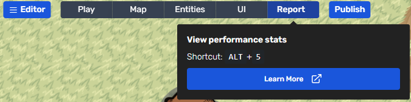
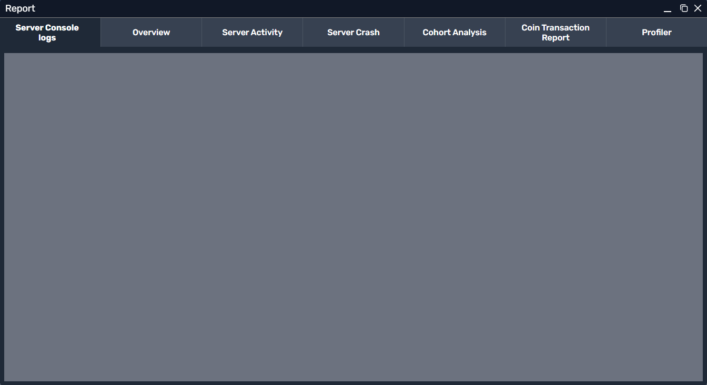
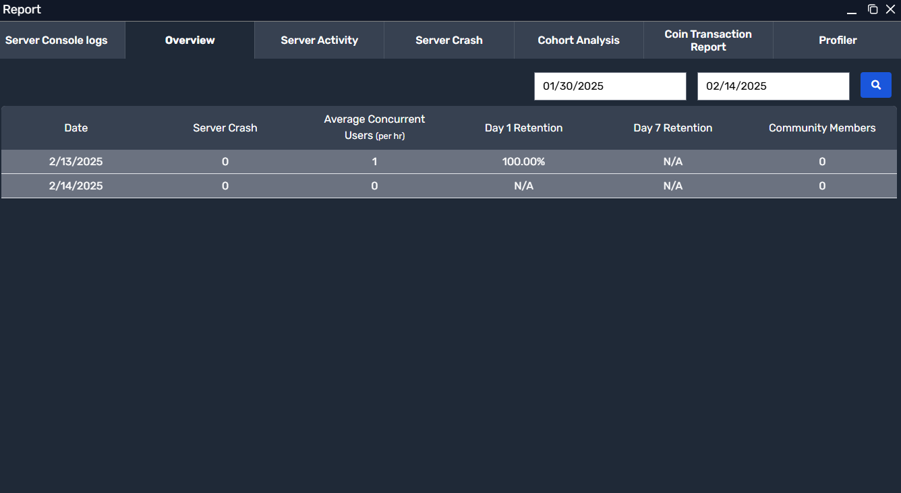
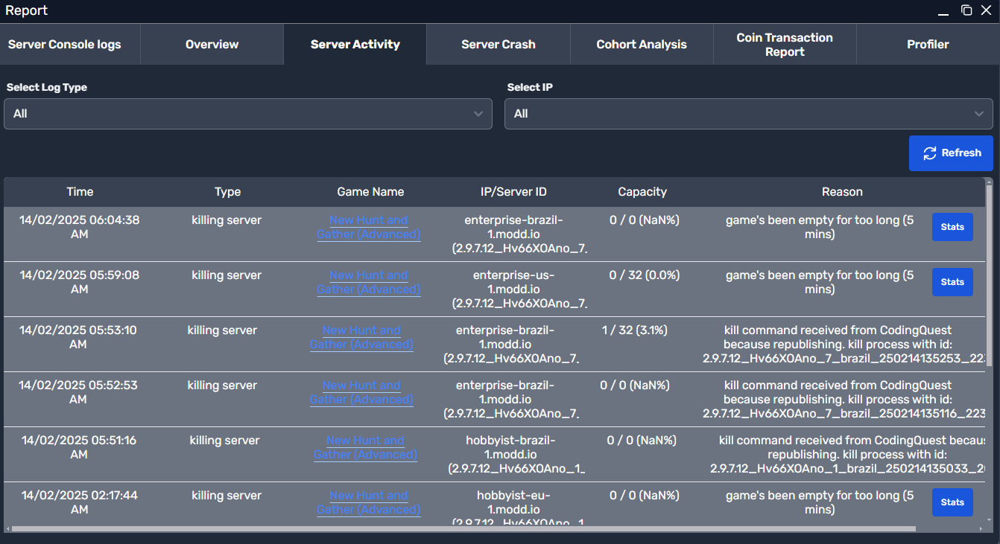
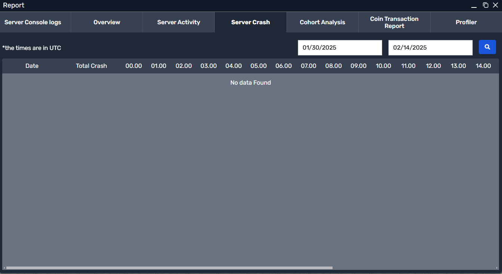
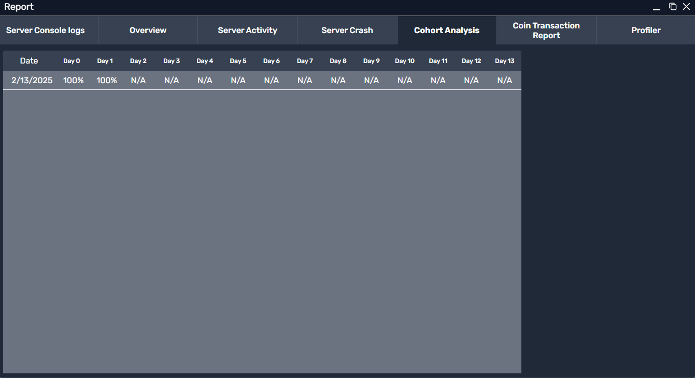
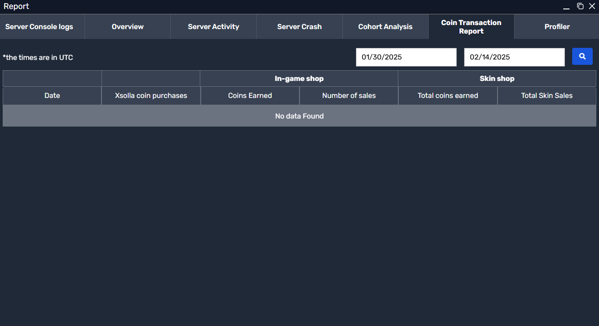
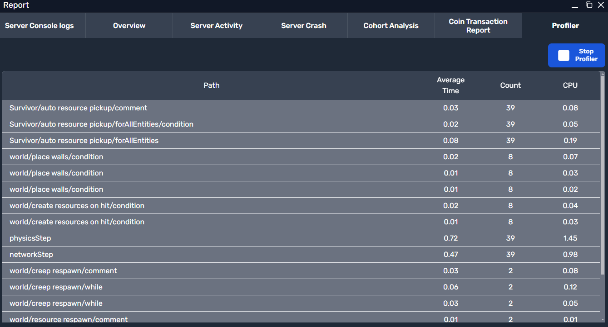

# Reports Overview

The Reports tab provides real-time insights and diagnostic tools for monitoring your game's performance. Use it to track player behavior, optimize server resources, and troubleshoot issues.

*The main Reports tab interface showing diagnostic tools*

---

## Report Categories

| Tab                    | Purpose                 | Key Metrics              | Access Frequency          |
|------------------------|-------------------------|--------------------------|---------------------------|
| **Server Console Logs**| Debug errors & track events | Error codes, warnings | During development/testing|
| **Overview**           | Daily health check      | CCU, crashes, revenue    | Daily monitoring          |
| **Server Activity**    | Server lifecycle tracking | Active/closed servers  | Weekly optimization       |
| **Server Crash**       | Crash diagnostics       | Crash timestamps, error patterns | Incident investigation |
| **Cohort Analysis**    | Player retention        | D1/D7/D30 retention      | Post-launch analysis      |
| **Coin Transaction**   | In-game purchase tracking | Purchases, sales, currency usage | Daily/weekly monitoring |
| **Profiler**           | Performance optimization| CPU usage, script timing | Before major updates      |

---

### Server Console Logs 
**Your game's diagnostic terminal**  
Displays real-time server output including:
- `[ERROR]` messages (critical failures)
- `[WARNING]` messages (potential issues)
- Custom `console.log()` outputs from your scripts

*Example of the Server Console Logs tab (currently empty in the screenshot)*

**Common Use Cases:**
1. Debugging script errors during playtests  
2. Monitoring custom event triggers  
3. Identifying network latency spikes  

*Tip: Filter logs using CTRL+F (Cmd+F on Mac) for specific error codes.*

---

### Overview Dashboard
**Daily performance snapshot**  
Key metrics updated every 24 hours:
- **CCU (Concurrent Users):** Peak simultaneous players
- **Crash Rate:** `Server crashes / Total sessions`
- **Community Growth:** New followers/players per day
- **Revenue:** Marketplace & premium content earnings

*Showing date-based metrics, retention, and crash info*

*Example: A spike in crashes with high CCU may indicate server scaling issues.*

---

### Server Activity Monitor
**Server lifecycle tracker**  
Track server instances with:
- **Active Servers:** Currently running games
- **Server Uptime:** Duration since startup
- **Shutdown Reasons:** Manual closure vs auto-timeout

*List of active/closed servers, shutdown reasons, and timestamps*

*Important: Sudden drops in active servers may indicate ISP issues or DDoS attacks.*

---

### Server Crash Analyzer 
**Post-mortem crash reports**  
Critical data for each crash:
- **Timestamp:** Exact crash time (UTC)
- **Error Code:** e.g., `ERR_MEMORY_LEAK`
- **Player Count:** Users affected
- **Stack Trace:** Last executed script lines

*No data found in this example screenshot*

*Pro Tip: Compare crash patterns with Console Logs for full context.*

---

### Cohort Analysis 
**Player retention metrics**  
Understand long-term engagement:
- **D1 Retention:** % returning next day
- **D7 Retention:** % returning after week
- **D30 Retention:** % returning after month
- **Revenue per Cohort:** Monetization over time

*Example data showing Day 1, Day 7 retention metrics*

*Use Case: If D1 < 20%, consider improving onboarding/tutorials.*

---

### Coin Transaction Report
**In-game currency and sales tracking**  
Monitor your monetization channels with:
- **Xsolla Coin Purchases**  
- **Coins Earned**  
- **Number of Sales**  
- **Total Coins Earned**  
- **Total Skin Sales**

*No data found in this example screenshot*

*Tip: Filter by date range to see how in-game sales fluctuate over time.*

---

### Profiler Tool 
**Performance optimization suite**  
Measure script efficiency with:
- **CPU Load:** Per-script % utilization
- **Execution Time:** Avg. script duration
- **Call Frequency:** Triggers per minute
- **Memory Usage:** Heap allocations

*Showing CPU usage, average time, count, and more*

**Workflow:**
1. Start profiling → Reproduce issue → Stop profiling  
2. Sort by CPU% to find bottlenecks  
3. Test optimizations → Repeat  

*Warning: Profiling adds overhead—don't leave it running in production!*

